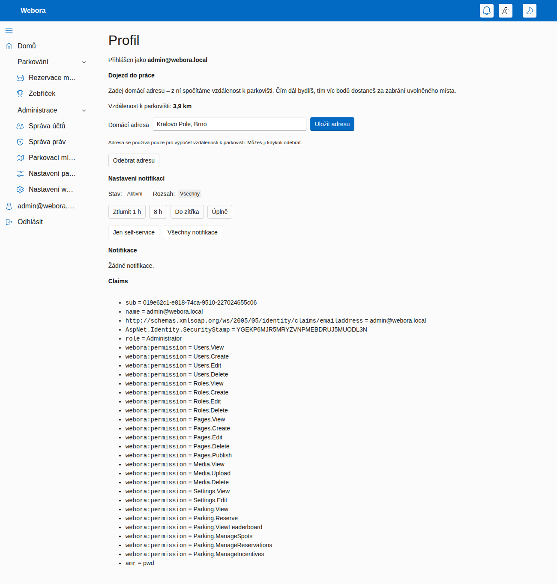

# Webora

Webora je **rezervační systém parkovacích míst pro sdílené/firemní parkoviště**, postavený kolem
**motivačního systému, který maximalizuje, jak dobře je parkoviště využíváno**. Zaměstnanci si rezervují
místa na časové okno; **rezervace stojí kredit**, jehož cena roste ve špičce a s obsazeností, takže
vzácná místa proudí tam, kde jsou nejvíc potřeba. Souběžně běží **reputační body**, které odměňují
chování uvolňující vzácná místa — parkování mimo špičku, uvolnění nevyužité rezervace a sdílení
vyhrazeného („rezidentního") místa — a penalizují nedostavení se.

- **Výchozí přihlášení administrátora:** `admin@webora.local` / `Admin123$` (viz `IdentitySeed`
  v `src/Webora.Web/appsettings.json`).
- **Jazyky UI:** čeština (výchozí) a angličtina, vyjednané z cookie kultury / prohlížeče.

## Náhledy

**Kompletní průchod** — přihlášení, rezervace místa (každá možnost ukazuje cenu i body, které by
přinesla), žebříček a ladění živých nastavení:


Rezervační stránka detailně — vaše vyhrazené (rezidentní) místo, volná místa s živým náhledem ceny
a bodů a vaše rezervace:


**Žebříček** — skóre, statistiky chování a získané odznaky:


**Správa míst** — správa míst a přiřazování rezidentů:


**Nastavení parkování** — pravidla motivace a ekonomiky, laditelná za běhu (uložená v databázi):


**Profil** — zadání domácí adresy; geokóduje se na dojezdovou vzdálenost, která škáluje odměnu za
sdílené místo:



## Parkování, kredity a motivace

### Místa a rezervace

- **Místa** mají kód (`A-12`), typ (`Standard`, `Disabled`, `ElectricCharging`, `Visitor`,
  `Motorcycle`), příznak aktivity a volitelné poznámky. Administrátoři je spravují na
  **`/admin/parking/spots`**.
- **Rezervace** zabírá jedno místo na časové okno. Životní cyklus je stavový automat:

  ```
  Reserved ──▶ CheckedIn ──▶ Completed        (místo bylo využito)
     │
     ├──▶ Released      (uvolněno předem — uvolní místo ostatním)
     ├──▶ Cancelled     (zrušeno)
     └──▶ NoShow        (bez příjezdu do uplynutí ochranné lhůty)
  ```

- Uživatelé rezervují, přijíždějí („Příjezd"), odjíždějí („Odjezd"), uvolňují („Uvolnit") nebo ruší na
  **`/parking`**, kde se zároveň zobrazuje **cena rezervace** i body, které by každá akce přinesla.

### Kredity a cena rezervace

Rezervace se **platí kreditem** z osobní **peněženky**, která je oddělená od reputačních bodů
(viz níže). Cena je dynamická a počítá se pro **požadované časové okno**:

```
cena = základ × přirážka_za_špičku × přirážka_za_obsazenost   (zastropováno na maximum)
```

- **Špička** zdražuje: ve špičkovém okně je cena vyšší než mimo špičku (výchozí násobič ×2).
- **Obsazenost** zdražuje lineárně: čím je parkoviště v daném okně plnější (poměr obsazených k aktivním
  místům), tím výš cena šplhá, až po nastavený strop.
- Mimo špičku v prázdném parkovišti se platí **základní cena**; ve špičce na plném parkovišti se platí
  **maximum**.

Tok kreditu:

- **Kredit se strhne při rezervaci.** Pokud peněženka nestačí, rezervace neprojde.
- **Včasné zrušení nebo uvolnění** (před cutoffem pro uvolnění) **vrátí celou částku** zpět — místo se
  stihne nabídnout někomu jinému.
- **Nedostavení se (no-show)** strženou cenu **propadá** (a navíc se uplatní reputační penalizace).

Peněženka se plní ze dvou zdrojů:

- **Měsíční příděl kreditů** — každý uživatel dostane jednou za kalendářní měsíc konfigurovatelný
  příděl (uděluje ho údržbová smyčka i líně při první rezervaci v měsíci).
- **Odměny za chování** — tytéž odměny, které zvyšují reputaci, dobíjejí i peněženku, takže ohleduplné
  chování financuje vaše budoucí parkování.

### Body (reputace) a žebříček

**Body** jsou nově čistě **reputační skóre** pro **žebříček** (`/parking/leaderboard`) a **odznaky**;
získávají se za ověřené chování a **utrácení kreditu je nikdy nesnižuje**. Odměny se připisují **za
ověřené výsledky** (při dokončení / reálném využití), nikdy jen za samotnou rezervaci, a zároveň
zvyšují jak reputaci, tak peněženku:

| Důvod | Kdy | Poznámky |
| --- | --- | --- |
| **Bonus mimo špičku** | při dokončení | rezervace začala mimo špičkové okno |
| **Uvolnění** | při včasném uvolnění | před cutoffem; denně zastropováno na uživatele |
| **Obsazení sdíleného místa** | při dokončení | obsazení sdíleného rezidentního místa; škálováno dojezdem |
| **Sdílení rezidenta** | při proaktivním uvolnění | dle toho, jak brzy + dle měsíčního přídělu rezidenta |
| **Penalizace za no-show** | údržbovou smyčkou | rezervace bez příjezdu po ochranné lhůtě |
| **Vratka sdílení** | smyčkou / rekonciliací | promarněný sdílený den (host nedorazil) nebo nerezervovaný |

Vedle reputačních důvodů eviduje účetní kniha (ledger) i pohyby peněženky: **měsíční příděl kreditu**,
**stržení za rezervaci** a **vrácení kreditu**. Odznaky: *Ohleduplný kolega*, *Šampion mimo špičku*,
*Spolehlivý parkovač*, *Klub stovky*.

### Vyhrazená místa pro rezidenty

Místu lze administrátorem přiřadit **rezidentního vlastníka** (např. držitele firemního auta). Místo je
pak **drženo pro rezidenta každý den až do konfigurovatelného cutoffu** (`ResidentHoldUntil` + ochranná
lhůta no-show):

- Rezident **potvrdí příjezd**, aby si místo na den udržel, nebo ho **uvolní** (na jeden den nebo
  rozsah dnů) do sdíleného fondu.
- Pokud do cutoffu nepotvrdí ani neuvolní, místo se na ten den **automaticky sdílí**.
- **Pravidlo konfliktu:** jakmile si host sdílené místo zarezervuje, je pevné; pozdě dorazivší rezident
  soutěží o volné místo jako každý jiný (žádné vyhazování).
- Před cutoffem se posílá připomínka.

**Odměna za sdílení rezidenta** je odstupňovaná: `min(strop, hodiny_předstihu × sazba) × (1 + příděl ×
pct/100)`. **Měsíční příděl sdílení**, který si rezident nastaví, je zároveň násobič odměny **i tvrdý
strop** počtu odměněných sdílených dnů za kalendářní měsíc. Odměna je fakticky podmíněna poptávkou:

- host místo využil → odměna zůstává;
- host rezervoval, ale nedorazil → částečná vratka;
- nikdo uvolněný den nerezervoval → odměnu plně zruší denní rekonciliace.

### Faktor dojezdové vzdálenosti

Obsazení sdíleného místa je odměněno tím víc, čím dál dojíždí ten, kdo ho obsadí (se stropem), takže
vzácná místa plynou k těm, kdo je nejvíc potřebují. Uživatelé zadají **domácí adresu** v profilu; ta se **geokóduje**
(Nominatim) a spočte se **vzdálenost k parkovišti**.

- Poskytovatel vzdálenosti je zaměnitelný: **Haversine** (vzdušnou čarou, offline; výchozí) nebo **OSRM**
  silniční vzdálenost (`Distance:Provider = "Osrm"`), která **spadne zpět na Haversine**, pokud je
  routovací služba nedostupná.
- Samostatně nahlášená adresa získá odměnu za vzdálenost až po **ověření** — buď administrátorem (na
  stránce úpravy uživatele), nebo **automaticky**, je-li v rámci konfigurovatelného limitu vzdálenosti
  (`AutoVerifyHomeAddress`). Adresu může uživatel kdykoli odstranit.

### Ochrana proti zneužití

Systém je zpevněn proti farmaření:

1. Cena rezervace + měsíční příděl tvoří uzavřenou ekonomiku; rezervace/uvolnění ve smyčce je v čistém
   nule (stržení se vrátí), takže nic nevydělá.
2. Odměny mimo špičku a za vzdálenost se platí **při dokončení**, ne při rezervaci.
3. Odměněná **uvolnění jsou denně zastropována**.
4. **Měsíční příděl sdílení zastropuje** odměněné sdílené dny za měsíc.
5. Uvolněné dny, které **nikdo nerezervoval, se rekonciliují** a odměna se zruší.
6. Odměna za vzdálenost vyžaduje **ověřenou adresu**.

### Údržba na pozadí

Hostovaná služba (`ParkingMaintenanceService`) běží v konfigurovatelném intervalu `SweepInterval` a
v každém cyklu: posílá připomínky rezervací, posílá připomínky držení rezidentům, řeší no-shows (s
penalizacemi a notifikacemi), rekonciliuje nevyužité sdílené dny a **uděluje měsíční příděl kreditů**.
Lze ji také spustit ručně ze stránky správy míst.

### Role a oprávnění

Jemná oprávnění hlídají UI i služby: `Parking.View`, `Parking.Reserve`, `Parking.ViewLeaderboard`,
`Parking.ManageSpots`, `Parking.ManageReservations`, `Parking.ManageIncentives`. Seedované role
`Viewer`/`Editor` mohou prohlížet, rezervovat a vidět žebříček; `Administrator` má vše.

## Konfigurace

Většina chování parkování je **uložena v databázi a editovatelná za běhu** na
**`/admin/parking/settings`** (`Parking.ManageIncentives`) — bez nasazování. Laditelné hodnoty zahrnují:

- **Ekonomika rezervací:** základní cena, přirážka za špičku (%), přirážka za obsazenost (%), maximální
  cena, měsíční příděl kreditů.
- **Body:** uvolnění, bonus mimo špičku, penalizace za no-show.
- **Okno špičky:** čas začátku / konce.
- **Časování (minuty):** cutoff pro uvolnění, ochranná lhůta no-show, předstih připomínky, interval
  údržbové smyčky.
- **Rezidenti:** denní čas držení, body za hodinu předstihu, strop odměny, max. příděl sdílení, % násobiče
  za povolené sdílení, % vratky za promarněné sdílení.
- **Faktor vzdálenosti:** souřadnice parkoviště, základní body, referenční km, max. násobič.
- **Ověřování a limity:** přepínač auto-ověření + limit vzdálenosti, max. odměněných uvolnění/den, max.
  rozsah uvolnění ve dnech.

Možnosti na úrovni infrastruktury jsou v `appsettings.json`:

```jsonc
"Geocoding": { "NominatimBaseUrl": "https://nominatim.openstreetmap.org", "UserAgent": "Webora/1.0 (parking)" },
"Distance":  { "Provider": "Haversine", "OsrmBaseUrl": "https://router.project-osrm.org" }
```

> Poznámka k produkci: odchozí přístup ke geokódovací (a případně routovací) službě musí být povolen
> síťovou politikou a je nutné respektovat pravidla použití Nominatimu (rate limit, identifikující
> User-Agent). Ukládání domácích adres je osobní údaj — získejte souhlas a nastavte retenční politiku.

## Engine

Engine je řešení v .NET 10 organizované podle Clean Architecture:

| Projekt | Odpovědnost | Klíčové závislosti |
| --- | --- | --- |
| `Webora.Domain` | Entity, hodnotové objekty, doménová pravidla. Bez frameworkových závislostí. | — |
| `Webora.Application` | Případy užití a Wolverine handlery zpráv. | WolverineFx |
| `Webora.Infrastructure` | EF Core/Postgres perzistence, Redis cache, ASP.NET Identity, OpenIddict stores, geokódování/vzdálenost. | EF Core, Npgsql, StackExchange.Redis, OpenIddict.EntityFrameworkCore |
| `Webora.Web` | Host: Blazor Web App (Auto), SignalR, Serilog, Wolverine + RabbitMQ, OpenIddict server, údržba parkování. | Serilog, WolverineFx.RabbitMQ, OpenIddict.AspNetCore |
| `Webora.Web.Client` | Komponenty Blazor WebAssembly klienta. | — |

Tok závislostí je `Domain ← Application ← Infrastructure ← Web`.

## Začínáme

Předpoklady: Docker. (.NET 10 SDK je potřeba jen pro hostitelský postup níže.)

### Vše v Dockeru

```bash
docker compose up --build
```

Sestaví image aplikace a spustí ji vedle Postgresu, Redisu, RabbitMQ a smtp4dev. Kontejner běží v
prostředí `Development`, takže při startu aplikuje EF migrace a naseeduje účet administrátora. Jakmile
běží:

- Aplikace: http://localhost:8080
- Zachycené e-maily (smtp4dev): http://localhost:5099
- RabbitMQ management: http://localhost:15672 (`guest` / `guest`)

### Aplikace na hostiteli

Spusťte jen podpůrné služby a engine se SDK — vhodné pro ladění:

```bash
# 1. Pouze podpůrné služby
docker compose up -d postgres redis rabbitmq smtp4dev

# 2. Spuštění enginu (Development automaticky aplikuje migrace a naseeduje administrátora)
dotnet run --project src/Webora.Web
```

Podpůrné služby se konfigurují přes `ConnectionStrings` v `src/Webora.Web/appsettings.json`
(`Postgres`, `Redis`, `RabbitMq`). Zapojení RabbitMQ se aktivuje jen při nastaveném connection stringu;
vyprázdnění `ConnectionStrings:RabbitMq` (a `:Redis`) spustí aplikaci jen nad Postgresem.

E-maily se posílají přes SMTP dle sekce `Smtp`. Výchozí je lokální záchytka smtp4dev (`localhost:2525`,
bez autentizace); zachycené zprávy si prohlédnete na http://localhost:5099. Pro produkci nastavte
`Smtp:Authentication` na `Basic` nebo `OAuth2`.

### Databázové migrace

Prostředí `Development` aplikuje migrace při startu. Ruční správa:

```bash
# aplikace nejnovějšího schématu
dotnet ef database update --project src/Webora.Infrastructure --startup-project src/Webora.Web

# přidání migrace po změně modelu
dotnet ef migrations add <Nazev> --project src/Webora.Infrastructure --startup-project src/Webora.Web
```

Nástroj `dotnet-ef` se obnoví přes `dotnet tool restore` (připnutý v `dotnet-tools.json`).

## Technické poznámky

- **Blazor Web App** s oběma interaktivními režimy vykreslování; parkovací stránky se vykreslují na
  serveru (`InteractiveServer`), zvoneček notifikací běží na WebAssembly.
- **Lokalizace:** řetězce UI jsou v `Webora.Web/Resources/SharedResource.*.resx`; serverové texty
  notifikací v `Webora.Infrastructure/Resources/ParkingMessages.*.resx`.
- **Autentizace:** ASP.NET Core Identity (cookie přihlášení) + OpenIddict server + RBAC založené na
  oprávněních.
