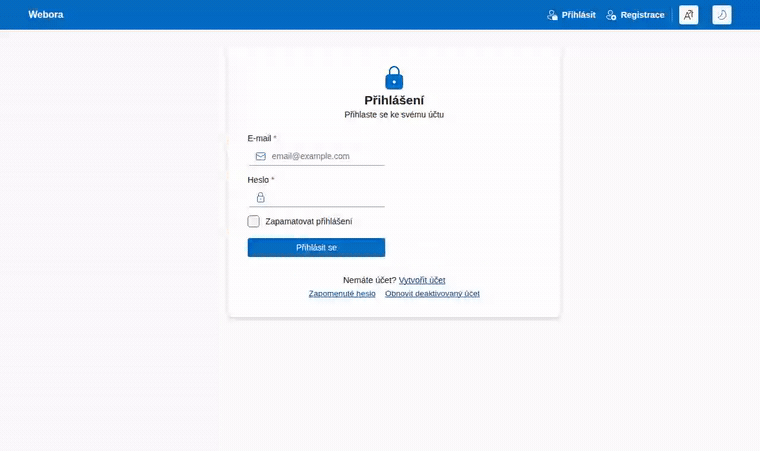
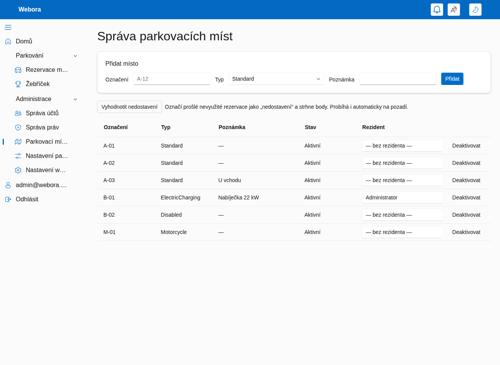
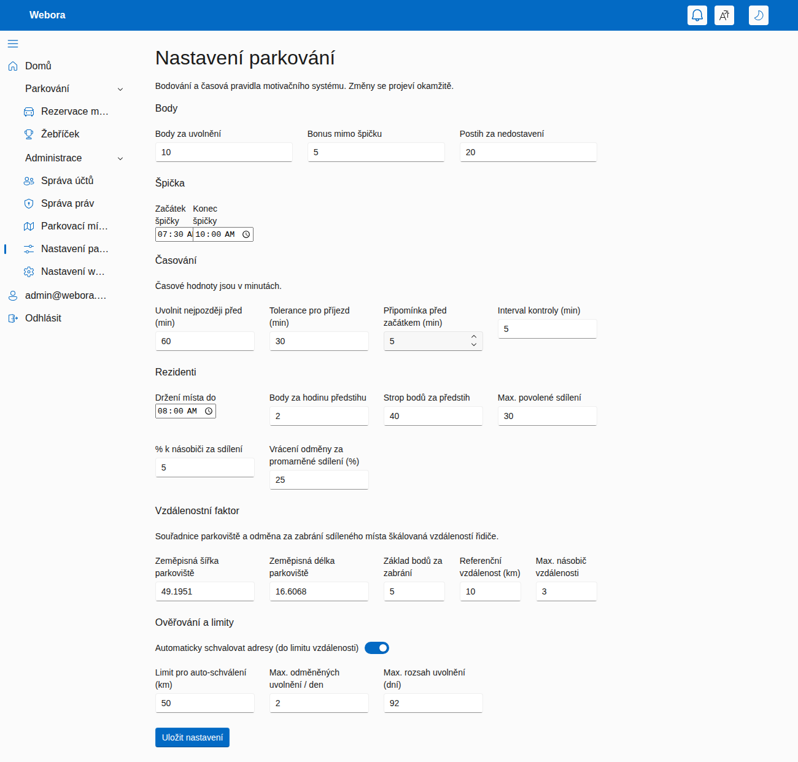

<div align="center">

# Webora

**Rezervační systém parkovacích míst pro sdílené / firemní parkoviště — s kreditovou ekonomikou
a motivačním systémem, který maximalizuje využití parkoviště.**

[](https://dotnet.microsoft.com/)
[](https://learn.microsoft.com/aspnet/core/blazor/)
[](https://www.postgresql.org/)
[](https://docs.docker.com/compose/)
[](#)
[](LICENSE)

</div>

---

Zaměstnanci si rezervují parkovací místa na časové okno. **Rezervace stojí kredit**, jehož cena roste
ve špičce a s obsazeností, takže vzácná místa proudí tam, kde jsou nejvíc potřeba. Souběžně běží
**reputační body**, které odměňují ohleduplné chování (parkování mimo špičku, včasné uvolnění, sdílení
vyhrazeného místa) a penalizují nedostavení se.

> **Výchozí administrátor:** `admin@webora.local` / `Admin123$` (viz `IdentitySeed` v
> `src/Webora.Web/appsettings.json`). **Jazyky UI:** čeština (výchozí) a angličtina.

## Obsah

- [Hlavní vlastnosti](#hlavní-vlastnosti)
- [Náhledy](#náhledy)
- [Rychlý start](#rychlý-start)
- [Architektura](#architektura)
- [Jak to funguje](#jak-to-funguje)
  - [Rezervace a jejich životní cyklus](#rezervace-a-jejich-životní-cyklus)
  - [Kredity a dynamická cena](#kredity-a-dynamická-cena)
  - [Body a reputace](#body-a-reputace)
  - [Rezidentní místa](#rezidentní-místa)
  - [Dojezdová vzdálenost](#dojezdová-vzdálenost)
  - [Ochrana proti zneužití](#ochrana-proti-zneužití)
  - [Údržba na pozadí](#údržba-na-pozadí)
  - [Role a oprávnění](#role-a-oprávnění)
- [Konfigurace](#konfigurace)
- [Vývoj](#vývoj)
- [Technické poznámky](#technické-poznámky)
- [Licence](#licence)

## Hlavní vlastnosti

- **Rezervace s životním cyklem** — typovaná místa a rezervace na časové okno jako stavový automat.
- **Kreditová ekonomika** — rezervace se platí kreditem z osobní peněženky; nedostatek kreditu blokuje.
- **Dynamická cena** — cena = základ × přirážka za špičku × přirážka za obsazenost, zastropováno.
- **Měsíční příděl** — každý uživatel dostává jednou za měsíc příděl kreditů; ohleduplné chování dobíjí.
- **Reputace a žebříček** — body oddělené od peněženky; utrácení je nesnižuje. Odznaky za chování.
- **Rezidentní místa** — místa držená pro vlastníka s odstupňovanou odměnou za sdílení do fondu.
- **Faktor dojezdu** — odměna za obsazení sdíleného místa škálovaná ověřenou dojezdovou vzdáleností.
- **Vše laditelné za běhu** — ceny, body, okna a limity se editují v administraci bez nasazování.

## Náhledy

**Kompletní průchod** — přihlášení, rezervace místa (s cenou i body), žebříček a ladění živých nastavení:



|  |  |
| --- | --- |
| **Rezervace** — vyhrazené místo, volná místa s živým náhledem ceny a bodů, vaše rezervace.<br> | **Žebříček** — skóre, statistiky chování a odznaky.<br> |
| **Správa míst** — správa míst a přiřazování rezidentů.<br> | **Nastavení** — pravidla ekonomiky a motivace, laditelná za běhu.<br> |

## Rychlý start

Jediný předpoklad je **Docker** (.NET 10 SDK je potřeba jen pro hostitelský postup ve [Vývoji](#vývoj)).

```bash
docker compose up --build
```

Sestaví image aplikace a spustí ji vedle Postgresu, Redisu, RabbitMQ a smtp4dev. Kontejner běží
v prostředí `Development`, takže při startu aplikuje EF migrace a naseeduje účet administrátora.

| Služba | URL |
| --- | --- |
| Aplikace | http://localhost:8080 |
| Zachycené e-maily (smtp4dev) | http://localhost:5099 |
| RabbitMQ management | http://localhost:15672 (`guest` / `guest`) |

## Architektura

Řešení v **.NET 10** organizované podle Clean Architecture; tok závislostí je
`Domain ← Application ← Infrastructure ← Web`.

| Projekt | Odpovědnost | Klíčové závislosti |
| --- | --- | --- |
| `Webora.Domain` | Entity, hodnotové objekty, doménová pravidla. Bez frameworkových závislostí. | — |
| `Webora.Application` | Případy užití a Wolverine handlery zpráv. | WolverineFx |
| `Webora.Infrastructure` | EF Core/Postgres perzistence, Redis cache, ASP.NET Identity, OpenIddict, geokódování. | EF Core, Npgsql, StackExchange.Redis, OpenIddict |
| `Webora.Web` | Host: Blazor Web App (Auto), SignalR, Serilog, Wolverine + RabbitMQ, OpenIddict server, údržba. | Serilog, WolverineFx.RabbitMQ, OpenIddict.AspNetCore |
| `Webora.Web.Client` | Komponenty Blazor WebAssembly klienta. | — |

## Jak to funguje

### Rezervace a jejich životní cyklus

**Místa** mají kód (`A-12`), typ (`Standard`, `Disabled`, `ElectricCharging`, `Visitor`, `Motorcycle`),
příznak aktivity a volitelné poznámky; administrátoři je spravují na `/admin/parking/spots`.
**Rezervace** zabírá jedno místo na časové okno a prochází stavovým automatem:

```
Reserved ──▶ CheckedIn ──▶ Completed        (místo bylo využito)
   │
   ├──▶ Released      (uvolněno předem — uvolní místo ostatním)
   ├──▶ Cancelled     (zrušeno)
   └──▶ NoShow        (bez příjezdu do uplynutí ochranné lhůty)
```

Uživatelé rezervují, přijíždějí („Příjezd"), odjíždějí („Odjezd"), uvolňují („Uvolnit") nebo ruší na
`/parking`, kde se zároveň zobrazuje **cena rezervace** i body, které by každá akce přinesla.

### Kredity a dynamická cena

Rezervace se **platí kreditem** z osobní **peněženky**, která je oddělená od reputačních bodů. Cena je
dynamická a počítá se pro **požadované časové okno**:

```
cena = základ × přirážka_za_špičku × přirážka_za_obsazenost      (zastropováno na maximum)
```

- **Špička** zdražuje — ve špičkovém okně je cena vyšší než mimo špičku (výchozí násobič ×2).
- **Obsazenost** zdražuje lineárně — čím plnější parkoviště v daném okně (poměr obsazených k aktivním
  místům), tím výš cena šplhá, až po nastavený strop.
- Mimo špičku v prázdném parkovišti se platí **základní cena**; ve špičce na plném parkovišti **maximum**.

**Tok kreditu:**

| Událost | Dopad na peněženku |
| --- | --- |
| Rezervace | strhne se cena; při nedostatku rezervace neprojde |
| Včasné zrušení / uvolnění (před cutoffem) | **vrátí se celá** stržená částka |
| Nedostavení se (no-show) | stržená částka **propadá** (+ reputační penalizace) |
| Měsíční příděl | jednou za kalendářní měsíc se připíše konfigurovatelný příděl |
| Odměny za chování | tytéž odměny, které zvyšují reputaci, **dobíjejí i peněženku** |

### Body a reputace

**Body** jsou čistě **reputační skóre** pro **žebříček** (`/parking/leaderboard`) a **odznaky**;
získávají se za ověřené chování a **utrácení kreditu je nikdy nesnižuje**. Odměny se připisují **za
ověřené výsledky** (při dokončení / reálném využití), nikdy jen za rezervaci, a zvyšují **současně
reputaci i peněženku**:

| Důvod | Kdy | Poznámky |
| --- | --- | --- |
| Bonus mimo špičku | při dokončení | rezervace začala mimo špičkové okno |
| Uvolnění | při včasném uvolnění | před cutoffem; denně zastropováno na uživatele |
| Obsazení sdíleného místa | při dokončení | obsazení sdíleného rezidentního místa; škálováno dojezdem |
| Sdílení rezidenta | při proaktivním uvolnění | dle předstihu + měsíčního přídělu rezidenta |
| Penalizace za no-show | údržbovou smyčkou | rezervace bez příjezdu po ochranné lhůtě |
| Vratka sdílení | smyčkou / rekonciliací | promarněný nebo nerezervovaný sdílený den |

Účetní kniha (ledger) eviduje vedle reputačních důvodů i pohyby peněženky: **měsíční příděl kreditu**,
**stržení za rezervaci** a **vrácení kreditu**. Odznaky: *Ohleduplný kolega*, *Šampion mimo špičku*,
*Spolehlivý parkovač*, *Klub stovky*.

### Rezidentní místa

<details>
<summary>Místa držená pro vlastníka s odstupňovanou odměnou za sdílení</summary>

Místu lze administrátorem přiřadit **rezidentního vlastníka** (např. držitele firemního auta). Místo je
pak **drženo pro rezidenta každý den až do konfigurovatelného cutoffu** (`ResidentHoldUntil` + ochranná
lhůta no-show):

- Rezident **potvrdí příjezd**, aby si místo na den udržel, nebo ho **uvolní** (jeden den, či rozsah dnů)
  do sdíleného fondu.
- Pokud do cutoffu nepotvrdí ani neuvolní, místo se na ten den **automaticky sdílí**.
- **Pravidlo konfliktu:** jakmile si host sdílené místo zarezervuje, je pevné; pozdě dorazivší rezident
  soutěží o volné místo jako každý jiný (žádné vyhazování).
- Před cutoffem se posílá připomínka.

**Odměna za sdílení** je odstupňovaná: `min(strop, hodiny_předstihu × sazba) × (1 + příděl × pct/100)`.
**Měsíční příděl sdílení**, který si rezident nastaví, je zároveň násobič odměny **i tvrdý strop** počtu
odměněných sdílených dnů za měsíc. Odměna je fakticky podmíněna poptávkou:

- host místo využil → odměna zůstává;
- host rezervoval, ale nedorazil → částečná vratka;
- nikdo uvolněný den nerezervoval → odměnu plně zruší denní rekonciliace.

</details>

### Dojezdová vzdálenost

Obsazení sdíleného místa je odměněno tím víc, čím dál dojíždí ten, kdo ho obsadí (se stropem), takže
vzácná místa plynou k těm, kdo je nejvíc potřebují. Uživatelé zadají **domácí adresu** v profilu; ta se
**geokóduje** (Nominatim) a spočte se **vzdálenost k parkovišti**.

- Poskytovatel je zaměnitelný: **Haversine** (vzdušnou čarou, offline; výchozí) nebo **OSRM** silniční
  vzdálenost (`Distance:Provider = "Osrm"`), která **spadne zpět na Haversine**, je-li služba nedostupná.
- Nahlášená adresa získá odměnu až po **ověření** — administrátorem, nebo **automaticky** v rámci limitu
  vzdálenosti (`AutoVerifyHomeAddress`). Adresu lze kdykoli odstranit.

### Ochrana proti zneužití

1. Cena rezervace + měsíční příděl tvoří uzavřenou ekonomiku; rezervace/uvolnění ve smyčce je v čisté
   nule (stržení se vrátí), takže nic nevydělá.
2. Odměny mimo špičku a za vzdálenost se platí **při dokončení**, ne při rezervaci.
3. Odměněná **uvolnění jsou denně zastropována**.
4. **Měsíční příděl sdílení zastropuje** odměněné sdílené dny za měsíc.
5. Uvolněné dny, které **nikdo nerezervoval, se rekonciliují** a odměna se zruší.
6. Odměna za vzdálenost vyžaduje **ověřenou adresu**.

### Údržba na pozadí

Hostovaná služba `ParkingMaintenanceService` běží v intervalu `SweepInterval` a v každém cyklu: posílá
připomínky rezervací a držení rezidentům, řeší no-shows (s penalizacemi a notifikacemi), rekonciliuje
nevyužité sdílené dny a **uděluje měsíční příděl kreditů**. Lze ji spustit i ručně ze správy míst.

### Role a oprávnění

Jemná oprávnění hlídají UI i služby: `Parking.View`, `Parking.Reserve`, `Parking.ViewLeaderboard`,
`Parking.ManageSpots`, `Parking.ManageReservations`, `Parking.ManageIncentives`. Seedované role
`Viewer`/`Editor` mohou prohlížet, rezervovat a vidět žebříček; `Administrator` má vše.

## Konfigurace

Většina chování je **uložena v databázi a editovatelná za běhu** na `/admin/parking/settings`
(`Parking.ManageIncentives`) — bez nasazování:

| Skupina | Volby |
| --- | --- |
| **Ekonomika rezervací** | základní cena, přirážka za špičku (%), přirážka za obsazenost (%), max. cena, měsíční příděl kreditů |
| **Body** | uvolnění, bonus mimo špičku, penalizace za no-show |
| **Okno špičky** | čas začátku / konce |
| **Časování (min)** | cutoff pro uvolnění, ochranná lhůta no-show, předstih připomínky, interval údržby |
| **Rezidenti** | denní čas držení, body/hod předstihu, strop odměny, max. příděl sdílení, % násobiče, % vratky |
| **Faktor vzdálenosti** | souřadnice parkoviště, základní body, referenční km, max. násobič |
| **Ověřování a limity** | auto-ověření + limit vzdálenosti, max. odměněných uvolnění/den, max. rozsah uvolnění (dny) |

Možnosti na úrovni infrastruktury jsou v `appsettings.json`:

```jsonc
"Geocoding": { "NominatimBaseUrl": "https://nominatim.openstreetmap.org", "UserAgent": "Webora/1.0 (parking)" },
"Distance":  { "Provider": "Haversine", "OsrmBaseUrl": "https://router.project-osrm.org" }
```

> **Poznámka k produkci:** odchozí přístup ke geokódovací (a případně routovací) službě musí být povolen
> síťovou politikou a je nutné respektovat pravidla Nominatimu (rate limit, identifikující User-Agent).
> Ukládání domácích adres je osobní údaj — získejte souhlas a nastavte retenční politiku.

## Vývoj

Pro ladění lze spustit jen podpůrné služby a engine z SDK na hostiteli:

```bash
# 1. Pouze podpůrné služby
docker compose up -d postgres redis rabbitmq smtp4dev

# 2. Spuštění enginu (Development automaticky aplikuje migrace a naseeduje administrátora)
dotnet run --project src/Webora.Web
```

Podpůrné služby se konfigurují přes `ConnectionStrings` v `src/Webora.Web/appsettings.json`
(`Postgres`, `Redis`, `RabbitMq`). Zapojení RabbitMQ se aktivuje jen při nastaveném connection stringu;
vyprázdnění `ConnectionStrings:RabbitMq` (a `:Redis`) spustí aplikaci jen nad Postgresem. E-maily míří na
lokální záchytku smtp4dev (`localhost:2525`, bez autentizace); pro produkci nastavte `Smtp:Authentication`
na `Basic` nebo `OAuth2`.

**Databázové migrace** (prostředí `Development` je aplikuje při startu):

```bash
# aplikace nejnovějšího schématu
dotnet ef database update --project src/Webora.Infrastructure --startup-project src/Webora.Web

# přidání migrace po změně modelu
dotnet ef migrations add <Nazev> --project src/Webora.Infrastructure --startup-project src/Webora.Web
```

Nástroj `dotnet-ef` se obnoví přes `dotnet tool restore` (připnutý v `dotnet-tools.json`).

## Technické poznámky

- **Blazor Web App** s oběma interaktivními režimy; parkovací stránky se vykreslují na serveru
  (`InteractiveServer`), zvoneček notifikací běží na WebAssembly.
- **Lokalizace:** řetězce UI v `Webora.Web/Resources/SharedResource.*.resx`; serverové texty notifikací
  v `Webora.Infrastructure/Resources/ParkingMessages.*.resx`.
- **Autentizace:** ASP.NET Core Identity (cookie přihlášení) + OpenIddict server + RBAC dle oprávnění.

## Licence

Vydáno pod licencí [MIT](LICENSE) — © 2026 Tomáš Vaněk.
