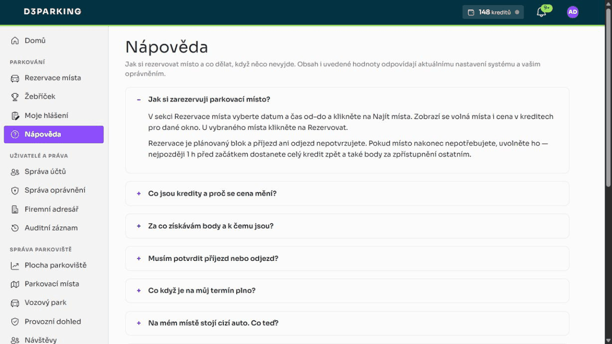

<div align="center">

# D3Parking

**Plánovač parkovacích míst pro sdílené / firemní parkoviště — s plánovacím rozpočtem
a motivačním systémem, který podporuje včasné uvolnění a sdílení míst.**

[](https://dotnet.microsoft.com/)
[](https://learn.microsoft.com/aspnet/core/blazor/)
[](https://www.microsoft.com/sql-server)
[](#)
[](LICENSE)

</div>

---

Zaměstnanci si plánují parkovací místa na časové okno. **Plán čerpá kreditový rozpočet**, jehož cena roste
ve špičce a s obsazeností, takže vzácná místa proudí tam, kde jsou nejvíc potřeba. Souběžně běží
**reputační body**, které odměňují ohleduplné chování (včasné uvolnění a sdílení vyhrazeného místa).
Příjezd ani odjezd se nepotvrzuje; připomínky jsou pouze informační.

> **Výchozí vývojový administrátor:** `admin@d3parking.local` / `Admin123$` (viz `IdentitySeed` v
> `src/D3Parking.Web/appsettings.Development.json`; produkce musí použít vlastní přihlašovací údaje).
> **Jazyky UI:** čeština (výchozí) a angličtina.

> **Technická dokumentace** — architektura, nasazení, konfigurace, vývoj a technické poznámky jsou
> v samostatném dokumentu [docs/TECHNICAL.md](docs/TECHNICAL.md).

## Obsah

- [Hlavní vlastnosti](#hlavní-vlastnosti)
- [Náhledy](#náhledy)
- [Jak to funguje](#jak-to-funguje)
  - [Rezervace jako plán](#rezervace-jako-plán)
  - [Kredity a dynamická cena](#kredity-a-dynamická-cena)
  - [Fronta při plném obsazení](#fronta-při-plném-obsazení)
  - [„Nemůžu zaparkovat" a omluvný kupón](#nemůžu-zaparkovat-a-omluvný-kupón)
  - [Body a reputace](#body-a-reputace)
  - [Úrovně a výhody](#úrovně-a-výhody)
  - [Rezidentní místa](#rezidentní-místa)
  - [Poloha a ověřování adres](#poloha-a-ověřování-adres)
  - [Ochrana proti zneužití](#ochrana-proti-zneužití)
  - [Provozní dohled](#provozní-dohled)
  - [Plocha parkoviště pro správce](#plocha-parkoviště-pro-správce)
  - [Mapa parkoviště](#mapa-parkoviště)
  - [Údržba na pozadí](#údržba-na-pozadí)
  - [Role a oprávnění](#role-a-oprávnění)
- [Technická dokumentace](docs/TECHNICAL.md)
- [Licence](#licence)

## Hlavní vlastnosti

- **Týdenní plánovač** — typovaná místa a plánované bloky na časové okno bez potvrzování přítomnosti.
- **Plánovací rozpočet** — rezervace čerpá kredit z osobního rozpočtu; nedostatek kreditu blokuje.
- **Dynamická cena** — cena = základ × přirážka za špičku × přirážka za obsazenost, zastropováno.
- **Měsíční příděl** — každý uživatel dostává jednou za měsíc příděl kreditů; ohleduplné chování dobíjí.
- **Reputace a žebříček** — body oddělené od peněženky; utrácení je nesnižuje. Odznaky za chování.
- **Poptávkové odměny** — odměna za uvolnění roste s obsazeností a délkou fronty (symetrie k ceně).
- **Úrovně** — reputační tiery Bronz–Platina a jejich konfigurovatelné výhody.
- **Výhody za reputaci** — vyšší tier = přednost ve frontě, větší příděl a sleva na cenu.
- **Rozklad reputace** — body časem slábnou, takže skóre odráží *současné* chování (a tresty se hojí).
- **Týmové žebříčky** — porovnání oddělení a sociální srovnání s průměrem vlastního týmu.
- **Historický graf důvěry** — PageRank a detekce recipročních dvojic nad staršími potvrzenými
  interakcemi; nový plánovač bez potvrzování přítomnosti do grafu nové hrany nepřidává.
- **Adaptivní ceny** — volitelný regulátor, který sám ladí přirážku za špičku k cílové obsazenosti.
- **Rezidentní místa** — místa držená pro vlastníka s odstupňovanou odměnou za sdílení do fondu.
- **Vozový park s typy vozidel** — evidence vozidel podle SPZ s bezpečným párováním na účty
  (SPZ + e-mail řidiče + kód z e-mailu). **Firemní vozidlo** má vedle rezervací nárok i na vlastní
  rezidentní místo (spárováním se řidič stává rezidentem); **vozidlo zaměstnance** rezervuje pouze
  z fondu — vlastní místo mu přidělit nejde.
- **Fronta při plném obsazení** — při plnu se uživatel postaví do fronty; uvolněné místo se mu přidrží a oznámí.
- **„Nemůžu zaparkovat"** — řidič u fyzicky zablokovaného místa jedním klikem dostane náhradní místo
  (nebo plnou vratku) bez sankce (max. 2 záznamy na uživatele a den). Záznam vyžaduje
  **fotografii zablokovaného místa** jako důkaz; každou fotku lze použít jen jednou (SHA-256 otisk
  s unikátním indexem). Správce u každé neshody vidí fotodůkaz i rezervace, které se s oknem na
  místě potkaly, a může držitele rovnou kontaktovat e-mailem. Jako omluva
  náleží **kupón na jednu rezervaci zdarma** (i ve špičce, max. 1 nevyčerpaný; včasné zrušení ho
  vrací) — kupón ale nejdřív podle fotky **schválí správce parkovacích míst**, platí 30 dní od
  schválení.
- **Provozní dohled jako fronta případů** — všechno, co čeká na rozhodnutí člověka (neshody, podezřelé
  dvojice, nahlášené závady), je **případ** s číslem, vlastníkem, lhůtou podle priority a nemazatelnou
  historií. Opakovaná hlášení na jednom místě zakládají případ rovnou s vyšší prioritou, po uplynutí
  lhůty se ozve systém sám a místo plošného rozesílání chodí adresné zprávy a jeden denní souhrn.
- **Řidič vidí, co se s jeho hlášením děje** — stránka *Moje hlášení* ukazuje stav, veřejnou část
  historie a otevřený dotaz správce. Řidič může doplnit informaci, odpovědět, hlášení **vzít zpět**
  (čekající kupón tím zaniká) a proti zamítnutému kupónu se **jednou odvolat**. Než odpoví, lhůta
  případu neběží.
- **Hlášení závad** — pokud je správce povolí, uživatel nahlásí nefunkční závoru, zhaslé světlo nebo
  překážku na místě, volitelně s fotkou; vzniká z toho případ pro správu míst.
- **Vše laditelné za běhu** — ceny, body, okna a limity se editují v administraci bez nasazování.
- **PWA** — aplikaci lze nainstalovat na plochu telefonu i počítače; bez připojení se zobrazí offline stránka.
- **Push notifikace** — upozornění dorazí i do zavřené nainstalované aplikace (Web Push s VAPID klíči).
- **Promyšlené notifikace** — zvoneček + push pro všechno; e-mail jen pro akční výzvy s termínem
  (nabídka z fronty s CTA tlačítkem a deadlinem), formální záznamy (penalizace, přiřazení místa)
  a bezpečnost (změna hesla/e-mailu). Všechny e-maily v jednotné brandované šabloně.
- **Export do kalendáře** — rezervaci lze jedním klikem stáhnout jako `.ics` (Outlook, Google i Apple
  Calendar) včetně připomínky 30 minut před začátkem.
- **Živá nápověda v aplikaci** — stránka `/help` načítá aktuální ceny, odměny, lhůty a přepínače
  funkcí z databáze. Kapitoly vypnutých funkcí a správcovské části bez příslušného oprávnění
  nezobrazuje. Lokalizovaná (cs/en).
- **Návštěvy** — recepce rezervuje návštěvnická místa hostům **bez účtu** (jméno, firma, SPZ,
  hostitel — ten dostane notifikaci, kde jeho návštěva parkuje). Místa typu *Návštěvnické* jsou
  vyčleněná z fondu zaměstnanců a SPZ návštěvy se automaticky páruje v neshodách obsazenosti.
- **Oznámení volné kapacity** — když je ve výhledu souvislý úsek dní z velké části volný, aplikace
  to (max. 1× denně, jen pracovní dny) připomene zvonečkem a push notifikací všem bez rezervace
  v období. Záměrně jen **stabilní agregát daleko dopředu** — nikdy okamžitá volnost jednoho místa,
  takže zpráva nemůže „vyprchat" ani rozpoutat závod o konkrétní místo (rezervace je stejně
  serializovaná). Prahy laditelné v administraci; uživatelé mají vlastní vypínač v profilu.

## Náhledy

Vizuální styl vychází ze značkového manuálu: plochy v Sherpa Blue, fialová jako akcent interaktivních
prvků, zelená jako výplň zvýraznění a písmo Sora. Rozhraní je v češtině i angličtině a má světlý
i tmavý režim.

**Domů** — hero s rychlou akcí, peněženka s body a úrovní, dnešní karty a dlaždice podle oprávnění:


**Rezervace místa** — vyhledání okna s živým cenovým náhledem (špička, obsazenost, zůstatek), karty
volných míst — a nahoře banner **omluvného kupónu** na rezervaci zdarma:


**Žebříček** — úroveň, reputační skóre a pořadí kolegů; u starších dat také historické statistiky:


**Provozní dohled** — jedna fronta případů se stavem, vlastníkem a termínem; v detailu fotodůkaz,
rezervace, které se s oknem potkaly, kontakt e-mailem a historie případu:


**Registrace** — vytvoření účtu na split-screen obrazovce s ukazatelem síly hesla:


**Přihlášení a používání** — přihlášení vývojového správce a přechod na osobní přehled:


**Dynamická nápověda** — ceny, odměny, limity a dostupné části administrace se načítají z aktuálního
nastavení systému a oprávnění přihlášeného uživatele:



**Administrace** — správa účtů, parkovací místa, živá *Pravidla a ceny* v záložkách a provozní dohled:


> Spuštění přes `dotnet run --project src/D3Parking.Web`, architektura a další technické detaily jsou
> v [docs/TECHNICAL.md](docs/TECHNICAL.md).

## Jak to funguje

### Rezervace jako plán

**Místa** mají kód (`A-12`), typ (`Standard`, `Disabled`, `ElectricCharging`, `Visitor`, `Motorcycle`),
příznak aktivity a volitelné poznámky; administrátoři je spravují na `/admin/parking/spots` — seznam
je **stránkovaný po 25 místech** (řazeno přirozeně, `P2-2` před `P2-10`) a hledá se v něm podle kódu;
nově založené místo si stránkování samo najde, ať v pořadí spadne kamkoli.
**Rezervace** zabírá jedno místo na časové okno a funguje jako plánovaný blok:

```
Planned ── časem ──▶ historie
   ├──▶ Released      (uvolněno předem — vrátí rozpočet a zpřístupní místo)
   └──▶ Cancelled     (zrušeno)
```

Uživatel zvolí den v týdenním plánovači, nastaví čas a místo naplánuje. Příjezd ani odjezd nepotvrzuje.
Pokud se plán změní, rezervaci uvolní; informační připomínka před začátkem je zachována.

### Kredity a dynamická cena

Rezervace se **platí kreditem** z osobní **peněženky**, která je oddělená od reputačních bodů. Cena je
dynamická a počítá se pro **požadované časové okno**:

```
cena = základ × přirážka_za_špičku × přirážka_za_obsazenost      (zastropováno na maximum)
```

- **Špička** zdražuje — ve špičkovém okně je cena vyšší než mimo špičku (výchozí násobič ×2).
- **Obsazenost** zdražuje lineárně — čím plnější parkoviště v daném okně (poměr obsazených k aktivním
  místům), tím výš cena šplhá, až po nastavený strop.
- Mimo špičku v prázdném parkovišti se platí **základní cena**; ve špičce na plném parkovišti **maximum**.

Volitelně lze zapnout **adaptivní ceny**: proporcionální regulátor pravidelně změří obsazenost
špičkového okna a sám posouvá přirážku za špičku k **cílové obsazenosti** (např. 85 %) — v pásmu
necitlivosti, po omezených krocích a v daných mezích. Ve výchozím stavu je vypnutý a je plně laditelný
za běhu v administraci.

**Tok kreditu:**

| Událost | Dopad na peněženku |
| --- | --- |
| Rezervace | strhne se cena; při nedostatku rezervace neprojde |
| Včasné zrušení / uvolnění (před cutoffem) | **vrátí se celá** stržená částka |
| Proběhlé plánované okno | bez další akce; plán se podle času zobrazí v historii |
| Měsíční příděl | jednou za kalendářní měsíc se připíše konfigurovatelný příděl |
| Odměny za chování | tytéž odměny, které zvyšují reputaci, **dobíjejí i peněženku** |

### Fronta při plném obsazení

Když pro zvolené okno není volné žádné místo, uživatel se může **postavit do fronty** (na `/parking`).
Fronta je vázaná na **konkrétní časové okno** a obsluhuje se podle priority `tier × náskok + minuty
čekání` (vyšší loajalitní úroveň má přednost, dlouho čekající nižší tier ji ale dožene):

- Jakmile se místo uvolní (uvolnění nebo zrušení), **přidrží se čekateli s nejvyšší
  prioritou**, jehož okno pokrývá, na konfigurovatelné claim okno (`QueueOfferMinutes`, výchozí 15 min),
  a přijde mu **notifikace + e-mail**.
- Přidržené místo je **skryté z běžné nabídky** a nelze ho zarezervovat někomu jinému.
- **Převzetí** = rezervace přidrženého místa za obvyklou dynamickou cenu (tehdy se strhne kredit a
  zkontroluje zůstatek). Když čekatel nestihne claim okno, přidržení **propadne dalšímu** v pořadí.
- Vstup do fronty je zdarma a je možný jen při skutečně plném obsazení.

Nabídky se vyhodnocují i průběžně v údržbové smyčce (expirace prošlých nabídek a doplnění nových).
Propadlá nabídka pošle čekatele na konec fronty, takže další uvolněné místo dostane další v pořadí.

### „Nemůžu zaparkovat" a omluvný kupón

Když řidič dorazí a jeho rezervované místo je fyzicky zablokované cizím autem, použije tlačítko
**„Nemůžu zaparkovat"** (dostupné během okna rezervace), které nabídne dvě cesty —
**„Najít mi jiné místo"** zarezervuje první volné místo pro stejné okno s převodem původní platby
(peněženka net nula), **„Jen zaznamenat stav"** rezervaci zruší s plnou vratkou bez ohledu na cutoff.
Obojí proběhne **bez sankce**. Součástí záznamu je **povinná fotografie zablokovaného
místa** — důkaz, který následně posuzuje správce.

- Pro řidiče je tok záměrně **pomocný, ne žalující**: nikde se nejmenuje ani neobviňuje kolega,
  eviduje se **stav místa** (neshoda obsazenosti). Správce ale na `/admin/parking/oversight` vidí
  u každého záznamu i **rezervace, které se s oknem na místě potkaly**, a může držitele i
  ohlašovatele rovnou **kontaktovat e-mailem**
  (předvyplněný mailto s místem a dnem).
- **SPZ blokujícího vozidla:** řidič ji může při záznamu rovnou opsat (nepovinné pole — stojí přímo
  u auta). Správce ji vidí spárovanou s **registrovanými vozidly zaměstnanců** (SPZ v profilu,
  porovnání ignoruje mezery a velikost písmen): shoda = jméno + e-mail na jeden klik, jinak
  **potvrzený vůz mimo systém** — a tedy podklad pro ostrahu či odtah dle řádu parkoviště.
- **Fotodůkaz (povinný):** k záznamu řidič přikládá fotografii zablokovaného místa pořízenou na
  místě (na mobilu se rovnou otevře fotoaparát). Ukládá se **SHA-256 otisk** fotky s unikátním
  indexem — **stejný soubor nelze použít ke dvěma záznamům nikdy** (ani jiným uživatelem, ani po
  čase); opakované předložení skončí srozumitelnou chybou. Limit 8 MB, formáty JPEG/PNG/WebP.
- **Omluvný kupón se schvalováním:** za potíž náleží kupón na **jednu rezervaci zdarma včetně
  špičkové ceny** — vzniká ale ve stavu **„čeká na schválení"**. Recenzent neshod
  (`Parking.ReviewMismatches`) posoudí v případu fotodůkaz a kupón **schválí, nebo zamítne**
  (vlastní kupón posoudit nesmí); tím zároveň případ uzavře — schválení je verdikt „hlášení bylo
  oprávněné". Řidič je o výsledku notifikován. Schválený kupón platí **30 dní od schválení**,
  uplatní se zaškrtnutím při rezervaci, drží se max. 1 nevyčerpaný (čekající nebo schválený) na
  uživatele a **včasné zrušení/uvolnění ho vrací**. Zamítnutý kupón nikdy hodnotu nezíská, příští
  poctivé hlášení ale neblokuje, a řidič se proti zamítnutí může **jednou odvolat** — případ se
  pak otevře znovu a nepřiřazený, aby ho neposuzoval tentýž člověk. Fronta je záměrně bez kupónů
  (odchod od vzácného claimnutého místa nesmí být bezbolestný).
- **Pojistky:** záznam jde pořídit jen v době okna rezervace a nejvýše 2× na uživatele a den —
  z toku se tak nedá udělat úniková cesta z nechtěných rezervací po refund cutoffu.

### Body a reputace

**Body** jsou čistě **reputační skóre** pro **žebříček** (`/parking/leaderboard`) a **odznaky**;
**utrácení kreditu je nikdy nesnižuje**. V režimu plánovaných bloků se odměňuje to, co lze ověřit
bez sledování fyzické přítomnosti: včasné uvolnění rezervace a zpřístupnění rezidentního místa.
Odměna zvyšuje **současně reputaci i peněženku**:

| Důvod | Kdy | Poznámky |
| --- | --- | --- |
| Uvolnění | při včasném uvolnění | **škálováno obsazeností + délkou fronty**, zastropováno; denně omezeno na uživatele |
| Sdílení rezidenta | při proaktivním uvolnění | podle předstihu, se stropem za den; bez měsíční kvóty |
| Vratka sdílení | denní rekonciliací | uvolněný den, který si nikdo nenaplánoval, vrátí původně přiznanou odměnu |

Účetní kniha (ledger) eviduje vedle reputačních důvodů i pohyby peněženky: **měsíční příděl kreditu**,
**stržení za rezervaci** a **vrácení kreditu**. Po přechodu na plánovač se nevytváří check-in,
dokončení ani no-show, takže se neudělují nové odměny za dokončení, mimo špičku či sérii. Historické
čítače a odznaky zůstávají čitelné kvůli kompatibilitě dat.

### Úrovně a výhody

Aby systém nebyl jen restriktivní, odměňuje vytrvalost a loajalitu hmatatelnými výhodami:

- **Poptávkové odměny za uvolnění** — odměna není fixní, ale roste s tím, jak moc je místo potřeba:
  přirážka podle obsazenosti lotu pro dané okno **plus bonus za každého čekajícího ve frontě**,
  zastropováno. Uvolnit místo ve špičce, když čekají lidé, vynáší výrazně víc než uvolnit nežádané
  místo — zrcadlí to přirážku za obsazenost u ceny.
- **Loajalitní úrovně** — z reputačních bodů se odvozuje tier **Bronz → Stříbro → Zlato → Platina**
  (hranice jsou laditelné). Tier je vidět v žebříčku.
- **Výhody vyššího tieru** — reputace se konečně vyplácí:
  - **přednost ve frontě** — pořadí se počítá jako `tier × náskok + minuty čekání`, takže vyšší tier
    je obsloužen dřív, ale dlouho čekající nižší tier ho dožene (žádné vyhladovění);
  - **vyšší měsíční příděl** — `základní příděl + bonus × tier`;
  - **sleva na cenu rezervace** — `sleva % × tier` (zastropováno, nikdy zdarma).
- **Rozklad reputace** — body se jednou za interval násobí `(1 − rozklad %)` (výchozí 10 % / 30 dní,
  0 = vypnuto). Protože míří k nule z obou stran, získané skóre se musí **udržovat aktivitou** a staré
  **penalizace se časem hojí**. Tiery i jejich výhody tak sledují současné chování, ne jednorázový vrchol.
- **Týmové žebříčky a sociální srovnání** — uživatel si v profilu nastaví **tým/oddělení**; žebříček pak
  ukazuje pořadí týmů (podle průměrné reputace členů) a kartu „můj tým" s pozicí v týmu a porovnáním
  vlastních čísel s průměrem týmu (normativní motivace).
- **Graf důvěry a anti-collusion** — zůstávají dostupné nad historickými rezervacemi ve stavu
  `Completed`. Nový plánovač přítomnost nepotvrzuje a tento stav nevytváří, takže bez importovaných
  či historických dat graf nezískává nové interakce.

### Rezidentní místa

<details>
<summary>Místa držená pro vlastníka s odstupňovanou odměnou za sdílení</summary>

Místu lze administrátorem přiřadit **rezidentního vlastníka**. Rezidence typicky vzniká přes **vozový
park**: nárok na vlastní místo mají jen **firemní vozidla** — správce vozidlu místo přidělí a řidič se
stane rezidentem spárováním účtu s vozidlem (vozidla zaměstnanců rezervují pouze z fondu; přepnutí
firemního vozidla na vozidlo zaměstnance vyžaduje místo odebrat a rezidence se uvolní). Místo je
pak řízeno **plánem využití rezidenta**:

- Zaškrtnutý den se drží rezidentovi bez potvrzování příjezdu; ostatní dny se **automaticky uvolní**
  do sdíleného fondu. Rezident může ručně uvolnit jeden den nebo rozsah dnů.
- **Plán využití:** rezident zaškrtne dny v týdnu, kdy místo potřebuje; ostatní dny se pak uvolňují
  **automaticky dopředu** až na `ResidentPlanHorizonDays` dní (výchozí 14) a odměňují se úplně stejně
  jako ruční uvolnění — tedy plným bonusem za předstih. Každý den se rozhoduje **jen jednou**
  (značka „aplikováno do"), takže údržba nemůže znovu sdílet den, který si rezident vzal zpět.
  Plán je autoritativní už pro dnešní den. Uložení plánu značku zahodí, takže se nový
  plán použije na celý horizont (a den vzatý zpět před změnou tím může být uvolněn znovu).
- **Konečná přednost rezidenta:** uvolněný den si může vzít zpět i poté, co si místo naplánoval host.
  Plán hosta se bez sankce zruší, celý rozpočet nebo kupón se vrátí a systém mu pošle notifikaci.
  Nabídka držená čekateli se stáhne, ale čekatel o pořadí nepřijde a dostane další uvolněné místo.
- Plánované dny nevyžadují denní potvrzení ani zvláštní rezidentní připomínku.

**Odměna za sdílení** je `min(strop za den, hodiny_předstihu × sazba)`. Každý nově uvolněný den
se hodnotí samostatně a žádný měsíční limit počtu uvolnění neexistuje. Odměna je podmíněna tím,
že uvolnění skutečně pomohlo plánování:

- někdo si na uvolněný den místo naplánoval → odměna zůstává;
- nikdo si uvolněný den nenaplánoval → odměnu plně zruší denní rekonciliace;
- rezident si den vezme zpět → odměna se odečte a případný plán hosta se bez sankce vrátí.

</details>

### Poloha a ověřování adres

Uživatel může v profilu zadat **domácí adresu**; geokódování (Nominatim) a souřadnice parkoviště
umožní spočítat vzdálenost a podle konfigurace adresu automaticky ověřit. V aktuálním plánovacím
režimu se vzdálenost nepoužívá k přidělování bodů — nastavení a uložené údaje zůstávají kvůli
ověřování a kompatibilitě starších instalací.

- Poskytovatel je zaměnitelný: **Haversine** (vzdušnou čarou, offline; výchozí) nebo **OSRM** silniční
  vzdálenost (`Distance:Provider = "Osrm"`), která **spadne zpět na Haversine**, je-li služba nedostupná.
- Adresu ověřuje administrátor, případně systém automaticky v nastaveném limitu
  (`AutoVerifyHomeAddress`). Uživatel ji může kdykoli odstranit.

### Ochrana proti zneužití

1. Cena rezervace + měsíční příděl tvoří uzavřenou ekonomiku; včasné uvolnění vrátí původní platbu
   a samostatná odměna je denně zastropovaná.
2. Uvolněné rezidentní dny, které si **nikdo nenaplánoval, se rekonciliují** a odměna se zruší.
3. Správce může srazit body či kredity jen s oprávněním `Parking.SanctionOversight`, jen účastníkovi
   konkrétního případu a s odůvodněním, které dotčený uvidí.
4. **„Nemůžu zaparkovat" jen v okně rezervace a max. 2× denně**; záznam vyžaduje **fotodůkaz**,
   jehož SHA-256 otisk je unikátní (stejná fotka nikdy nepodloží dva záznamy), a omluvný kupón
   **odemyká až schválení recenzentem neshod** (vlastní kupón schválit nelze). Drží se
   nejvýše jeden nevyčerpaný, expiruje za 30 dní a fronta je bez kupónů — falešná hlášení nemají
   co těžit.

### Provozní dohled

<details>
<summary>Jedna fronta případů nad vším, co čeká na rozhodnutí člověka</summary>

`/admin/parking/oversight` je jeden seznam nad **neshodami obsazenosti**, **podezřelými dvojicemi**
a — pokud jsou povolená — **závadami nahlášenými uživateli**. Starší instalace zde mohou mít také
historické spory o nedostavení; nový plánovač je už nevytváří. Každý signál čekající na člověka má
vlastní **případ**: číslo, vlastníka, lhůtu a nemazatelnou historii.

- **Případ je obálka nad signálem, ne jeho kopie.** Ukazuje na záznam s důkazy (hlášení, flag,
  závadu) a ten se čte za běhu — fotka, spárovaná SPZ i koncentrace dvojice mají jedno jediné místo.
  Na případu je jen to, co signál sám neumí říct: kdo to řeší a jak to dopadlo.
- **Stavy:** `Nový → Řeší se → Uzavřen`, plus `Čeká na řidiče`, když se správce na něco zeptal.
  Uzavřený případ jde znovu otevřít; předchozí závěr zůstává v historii, protože tam odvolaný verdikt
  patří.
- **Historie je jen k připisování** a u každého zápisu je vidět, jestli ho napsalo parkoviště, správce,
  nebo účastník. Interní poznámky a zprávy pro řidiče sdílejí jednu osu ve dvou čteních — dvě oddělené
  historie se dřív nebo později rozejdou a otázka „co jsme tomu člověku vlastně řekli" přestane mít
  jednu odpověď.
- **Lhůty podle priority** (kritická 4 h / vysoká 24 / běžná 72 / nízká 168, laditelné). Po jejich
  uplynutí se ozve systém sám — jednou, adresně vlastníkovi, u nepřevzatého případu všem, kdo si ho
  můžou vzít. Zvýšení priority ručně **přepočítá lhůtu od té chvíle**: „vyřeš to hned" nemůže znamenat
  termín v minulosti.
- **Priorita z opakování:** tři hlášení na jednom místě v okně zakládají případ rovnou jako vysokou
  prioritu, šest jako kritickou — a otevřené případy na tom místě se dozví, že se to stalo znovu.
  Vzorec je celá pointa a jinak ho držitel jednoho případu nikdy neuvidí.
- **Priorita z cizí SPZ:** opsaná značka se porovná se zaměstnanci, vozovým parkem i **návštěvami
  přes okno rezervace** — host je známý po dobu své návštěvy a cizí až týden nato. Potvrzené vozidlo
  mimo systém zvedne prioritu, a když jde o dnešní okno, rovnou na kritickou: zítra je to záznam,
  dnes je to auto v cestě.
- **Řidič může hlášení vzít zpět** („spletl jsem si řadu", „už je to opravené"). Případ se uzavře a
  čekající omluvný kupón s ním zaniká — na vlastní kupón je tohle jediný pohyb, který nepotřebuje
  hlídat, protože může jen ubrat.
- **Notifikace jsou adresné.** Okamžitě se ozve jen naléhavý případ; zbytek shrne **jeden denní souhrn
  sečtený na osobu** (kdo drží obě fronty, má jednu hromadu práce, ne dvě). Dřívější plošné rozesílání
  všem administrátorům skončilo — a s ním i to, že výzva k posouzení fotky chodila lidem, kteří na ni
  nemají oprávnění.
- **Dotaz na řidiče** zastaví hodiny: čekání na odpověď se do lhůty nepočítá a při odpovědi se termín
  posune přesně o dobu čekání — zeptat se je práce a nemá se za ni trestat. Když odpověď nepřijde do
  nastavené lhůty, případ se vrátí k rozhodnutí, ale **systém sám nic nerozhodne**.
- **Řidič to vidí taky** na `/parking/reports`: stav, veřejnou část historie, otevřený dotaz a
  možnost doplnit informaci. Interní poznámky se filtrují už v dotazu, ne v šabloně, a správce
  zůstává rolí, ne jménem.
- **Rozhodnutí vůči osobě** (výstraha, případně srážka bodů a kreditů) má vlastní oprávnění, míří jen
  na účastníka případu, nikdy na sebe a nikdy bez důvodu — ten dotčený uvidí. Zapíše se najednou do
  historie případu, knihy bodů, auditu účtu i notifikace. Je to samostatná ruční sankce a nemění
  historická počítadla dokončení či nedostavení.

</details>

### Plocha parkoviště pro správce

<details>
<summary>Živý přehled celé plochy, kalendář místa, ruční zásahy a analytika vytíženosti</summary>

`/admin/parking/dashboard` (`Parking.ManageSpots`) je jedna obrazovka, na které správce vidí i řeší
celé parkoviště — na rozdíl od [správy míst](#role-a-oprávnění), která je CRUD nad katalogem.

Stránka je rozdělená na dva taby — **Plocha** (parkoviště jako obrázek) a **Analytika** (parkoviště
jako čísla v čase) — nad nimi je souhrn, který platí pro oba.

- **Souhrn:** tabulka metrik s aktuálním číslem a **sparklinem za 14 dní** u těch, které denní
  historii opravdu mají (obsazenost, kolik vozů stojí na místech, nahlášené neshody a **promarněná
  sdílení** — dny, které rezident uvolnil a nikdo si je nevzal). Metriky bez denní historie
  (rezidentních míst, ve sdíleném fondu, ve frontě, návštěvy dnes, neaktivních) ukazují jen číslo;
  trendová čára by u nich byla vymyšlená. Okno souhrnu je záměrně pevné, aby se neměnilo, když
  někdo na druhém tabu přepne okno analytiky.
- **Plocha:** dlaždice míst seskupené do **sekcí podle prefixu kódu** (`A-12` → sekce `A`) a řazené
  přirozeně (`P2-2` před `P2-10`). Barva a tečka nesou stav, ale nikdy samy: dlaždice vždy pojmenuje
  vlastníka i držitele a legenda pojmenuje každý stav. Datum lze přepínat dopředu i dozadu — pro
  jiný než dnešní den dlaždice ukazují, co je na něj zarezervováno. Plocha se **donačítá rolováním**
  po dávkách po 60 dlaždicích; patka na konci se načte sama, jakmile se přiblíží do výřezu, a dá se
  i zmáčknout (kvůli klávesnici). Počet u sekce zůstává její skutečnou velikostí, ne počtem
  vykreslených dlaždic.
- **Precedence stavu** je jedno jediné místo v kódu: neaktivní místo je mimo parkoviště bez ohledu na
  vše ostatní, živá rezervace přebíjí nabídku z fronty a rezidentní místo je kapacita fondu teprve
  tehdy, když je skutečně sdílené. Stav `CheckedIn` se zobrazuje jen u historických dat.
- **Detail místa** se otevře **kliknutím na dlaždici** jako modální okno: nastavení, plán využití
  rezidenta, stav dnes, graf zatížení místa, **kalendář na 14 dní** (rezervace, návštěvy a uvolněné
  dny, které nikdo nezabral), historie nahlášených neshod a vytíženost.
- **Ruční zásahy** pro případ, kdy realita nesouhlasí se systémem:
  - **zrušení cizí rezervace** s **plnou vratkou bez ohledu na čas** — tady chybu udělalo
    parkoviště, ne řidič, takže platí stejné bezvinné pravidlo jako u zablokovaného místa (včetně
    vrácení omluvného kupónu, a to i s jeho stropem, aby zásah nebyl cestou kolem něj);
  - **přesun rezervace na jiné volné místo** — rezervace se jen **přesměruje**, nezakládá se nová:
    cena i historie zůstávají, takže se v peněžence nic nehýbe;
  - **odstavení místa** (údržba).

  Zrušit lze živý plán ve stavu `Reserved`; historický `CheckedIn` lze už jen přesunout. Každý zásah
  držitele notifikuje a zapíše se do jeho auditu (`ReservationOverridden`, aktér `admin:<id>`).
- **Analytika** v okně 7 / 30 / 90 dní, vedená **grafy** ([Blazor-ApexCharts](https://apexcharts.com/docs/blazor-charts/),
  MIT; Fluent UI Blazor charty nemá a odkazuje právě na něj):
  - **zatížení v čase** — plošný graf, kolik míst každý den někdo skutečně obsadil;
  - **nejvytíženější místa** — vodorovné pruhy, top 12, na škále 0–100 % celého okna (ne vůči
    nejlepšímu místu, jinak by prázdné parkoviště vypadalo plné);
  - **kdy poptávka dopadá** — heatmapa den v týdnu × hodina;
  - **zatížení konkrétního místa** — pruhový pás 30 dnů v detailu místa.

  Pod grafy zůstává **rozklikávací tabulka** všech míst s čísly, která graf nenese: neshody,
  sdílené a promarněné dny; u starších dat také historická nedostavení.

  Vytíženost vychází z plánovaných bloků, které nebyly zrušené ani uvolněné. Poptávka se měří
  v **obsazených hodinách míst**, ne v počtu rezervací, aby osmihodinová rezervace nesplynula
  s jedním tikem. Denní křivka škáluje
  k **dnešní** kapacitě — historii toho, kolik míst bylo v provozu kdy, systém nevede, takže denní
  jmenovatel by byl vymyšlený.

</details>

### Mapa parkoviště

<details>
<summary>Statický orientační plán pro řidiče</summary>

Správce s `Parking.ManageIncentives` nahraje v **Pravidlech a cenách** jeden orientační obrázek
parkoviště ve formátu PNG, JPEG nebo WebP (max. 12 MiB). Obrázek se ukládá do databáze a změna se
projeví bez nasazení nové verze.

- Mapa je čistě **orientační**: neobsahuje klikací místa a neurčuje dostupnost ani rezervovatelnost.
- Po rezervaci ji řidič otevře z detailu plánu a podle kódu místa se zorientuje v areálu.
- Když mapa není nahraná, tlačítko ani prázdný náhled se nezobrazují.
- Endpoint obrázku používá validovaný typ obsahu a veřejnou cache s verzovanou URL; po změně se
  klientům načte nová verze.

</details>

### Údržba na pozadí

Hostovaná služba `ParkingMaintenanceService` běží v intervalu `SweepInterval` a v každém cyklu posílá
informační připomínky rezervací, **uvolňuje dopředu dny podle plánů využití rezidentů** a rekonciliuje
nevyužité sdílené dny, **uděluje měsíční příděl kreditů**, **obsluhuje frontu** (expiruje prošlé nabídky
a přidržuje uvolněná místa dalším čekatelům), **rozkládá reputaci**, **ladí adaptivní ceny**,
**přepočítává graf důvěry**, **skenuje podezřelé kruhy (anti-collusion)** a nakonec **obsluhuje
provozní dohled** — zakládá případy pro nové signály, hlásí uplynulé lhůty, zapisuje na osu, že
noční sken dvojici přeměřil, vrací případy, na jejichž dotaz nikdo neodpověděl, a rozesílá denní
souhrn. Lze ji spustit i ručně ze správy míst.

### Role a oprávnění

Jemná oprávnění hlídají UI i služby: `Parking.View`, `Parking.Reserve`, `Parking.ViewLeaderboard`,
`Parking.ManageSpots`, `Parking.ManageFleet`, `Parking.ManageReservations`, `Parking.ManageVisitors`,
`Parking.ReviewMismatches`, `Parking.ReviewCollusion`, `Parking.AssignOversight`,
`Parking.SanctionOversight`, `Parking.ViewAnalytics`, `Parking.ManageIncentives`,
`Parking.VerifyResidency`. Seedované role `Viewer`/`Editor` mohou prohlížet, rezervovat a vidět
žebříček; `Administrator` má vše.

U provozního dohledu jsou oprávnění dělená záměrně: **co kdo vidí** rozhoduje podle druhu případu
(`ReviewMismatches` na fotky a SPZ, `ReviewCollusion` na jmenované dvojice, `ManageSpots` na
nahlášené závady) a **co kdo smí udělat** je od toho oddělené — případ si může vzít každý, kdo na
něj vidí, ale naložit práci kolegovi smí jen `AssignOversight` a rozhodnout vůči osobě jen
`SanctionOversight`.

Veškerá nastavení motivačního systému jsou **laditelná za běhu** v administraci; jejich přehled je
v [technické dokumentaci](docs/TECHNICAL.md#konfigurace). README popisuje schopnosti projektu;
pro skutečně zapnuté funkce, aktuální částky a lhůty konkrétní instalace je autoritativní živá
nápověda na `/help`.

## Licence

Vydáno pod licencí [MIT](LICENSE) — © 2026 Tomáš Vaněk.
