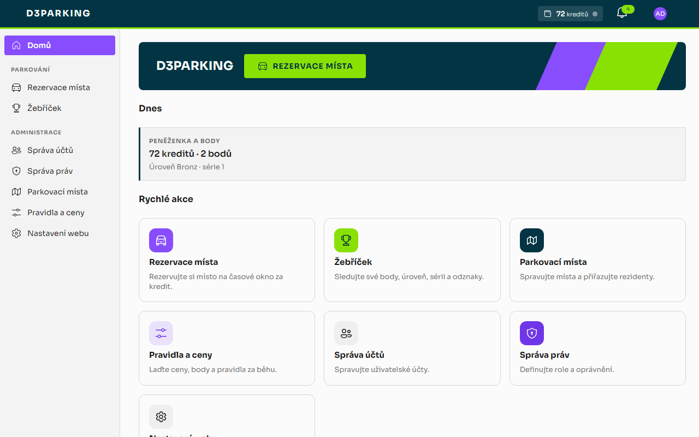
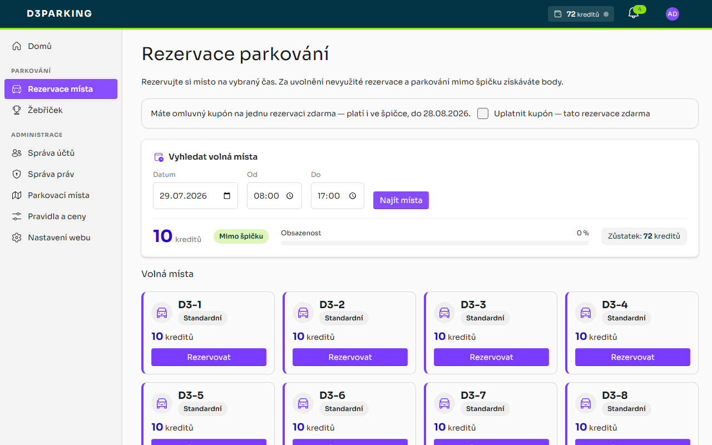
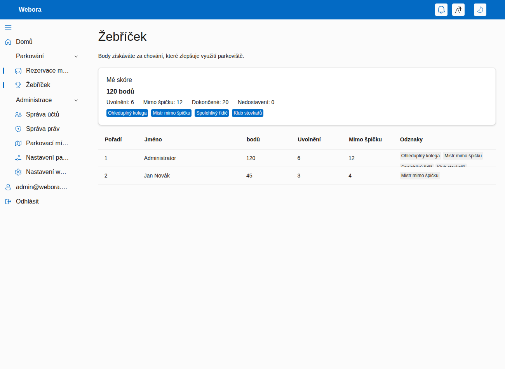
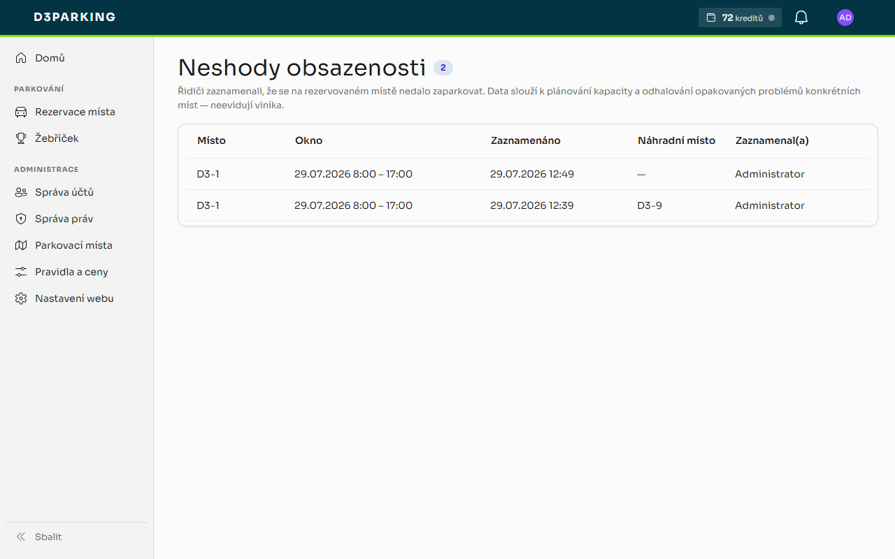
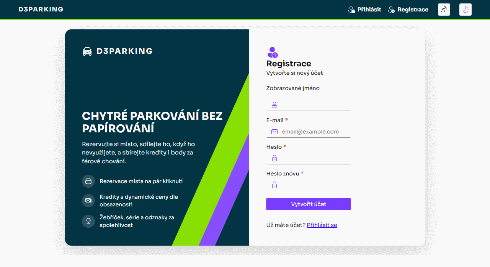
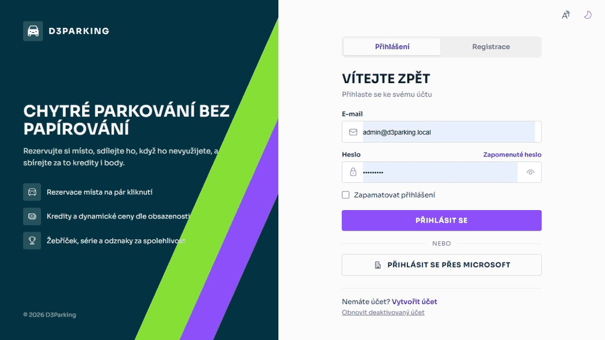
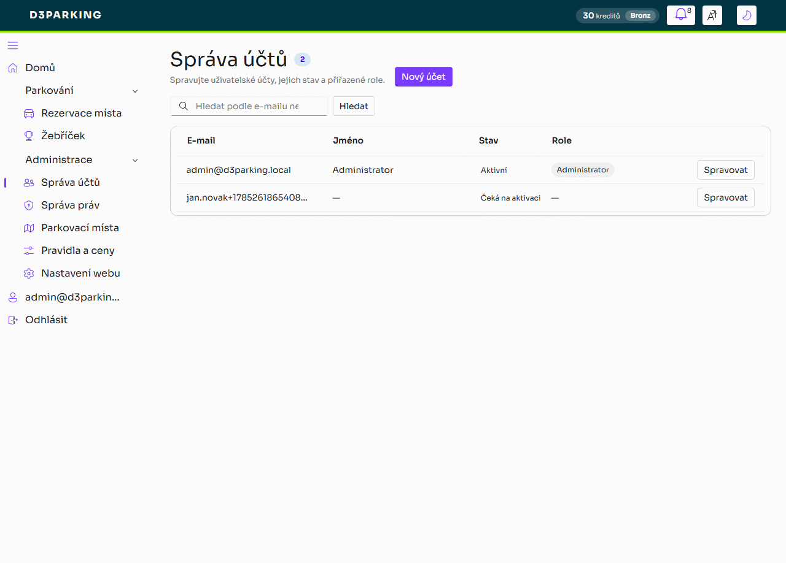

<div align="center">

# D3Parking

**Rezervační systém parkovacích míst pro sdílené / firemní parkoviště — s kreditovou ekonomikou
a motivačním systémem, který maximalizuje využití parkoviště.**

[](https://dotnet.microsoft.com/)
[](https://learn.microsoft.com/aspnet/core/blazor/)
[](https://www.microsoft.com/sql-server)
[](#)
[](LICENSE)

</div>

---

Zaměstnanci si rezervují parkovací místa na časové okno. **Rezervace stojí kredit**, jehož cena roste
ve špičce a s obsazeností, takže vzácná místa proudí tam, kde jsou nejvíc potřeba. Souběžně běží
**reputační body**, které odměňují ohleduplné chování (parkování mimo špičku, včasné uvolnění, sdílení
vyhrazeného místa) a penalizují nedostavení se.

> **Výchozí administrátor:** `admin@d3parking.local` / `Admin123$` (viz `IdentitySeed` v
> `src/D3Parking.Web/appsettings.json`). **Jazyky UI:** čeština (výchozí) a angličtina.

> **Technická dokumentace** — architektura, nasazení, konfigurace, vývoj a technické poznámky jsou
> v samostatném dokumentu [docs/TECHNICAL.md](docs/TECHNICAL.md).

## Obsah

- [Hlavní vlastnosti](#hlavní-vlastnosti)
- [Náhledy](#náhledy)
- [Jak to funguje](#jak-to-funguje)
  - [Rezervace a jejich životní cyklus](#rezervace-a-jejich-životní-cyklus)
  - [Kredity a dynamická cena](#kredity-a-dynamická-cena)
  - [Fronta při plném obsazení](#fronta-při-plném-obsazení)
  - [„Nemůžu zaparkovat" a omluvný kupón](#nemůžu-zaparkovat-a-omluvný-kupón)
  - [Body a reputace](#body-a-reputace)
  - [Série, úrovně a výhody](#série-úrovně-a-výhody)
  - [Rezidentní místa](#rezidentní-místa)
  - [Dojezdová vzdálenost](#dojezdová-vzdálenost)
  - [Ochrana proti zneužití](#ochrana-proti-zneužití)
  - [Údržba na pozadí](#údržba-na-pozadí)
  - [Role a oprávnění](#role-a-oprávnění)
- [Technická dokumentace](docs/TECHNICAL.md)
- [Licence](#licence)

## Hlavní vlastnosti

- **Rezervace s životním cyklem** — typovaná místa a rezervace na časové okno jako stavový automat.
- **Kreditová ekonomika** — rezervace se platí kreditem z osobní peněženky; nedostatek kreditu blokuje.
- **Dynamická cena** — cena = základ × přirážka za špičku × přirážka za obsazenost, zastropováno.
- **Měsíční příděl** — každý uživatel dostává jednou za měsíc příděl kreditů; ohleduplné chování dobíjí.
- **Reputace a žebříček** — body oddělené od peněženky; utrácení je nesnižuje. Odznaky za chování.
- **Poptávkové odměny** — odměna za uvolnění roste s obsazeností a délkou fronty (symetrie k ceně).
- **Série a úrovně** — bonus za nepřerušenou řadu dokončení a loajalitní tiery (Bronz–Platina).
- **Výhody za reputaci** — vyšší tier = přednost ve frontě, větší příděl a sleva na cenu.
- **Rozklad reputace** — body časem slábnou, takže skóre odráží *současné* chování (a tresty se hojí).
- **Týmové žebříčky** — porovnání oddělení a sociální srovnání s průměrem vlastního týmu.
- **Graf důvěry** — skóre důvěry (PageRank nad reálnými sdílecími interakcemi) + odznak „Důvěryhodný".
- **Anti-collusion** — detekce recipročních kruhů sdílení + cap váhy hrany v grafu důvěry; flagy k revizi.
- **Adaptivní ceny** — volitelný regulátor, který sám ladí přirážku za špičku k cílové obsazenosti.
- **Rezidentní místa** — místa držená pro vlastníka s odstupňovanou odměnou za sdílení do fondu.
- **Faktor dojezdu** — odměna za obsazení sdíleného místa škálovaná ověřenou dojezdovou vzdáleností.
- **Fronta při plném obsazení** — při plnu se uživatel postaví do fronty; uvolněné místo se mu přidrží a oznámí.
- **„Nemůžu zaparkovat"** — řidič u fyzicky zablokovaného místa jedním klikem dostane náhradní místo
  (nebo plnou vratku) bez rizika no-show (max. 2 záznamy na uživatele a den). Správce u každé
  neshody vidí i rezervace, které se s oknem na místě potkaly (typicky nedostavení), a může
  držitele rovnou kontaktovat e-mailem. Jako omluva náleží **kupón na jednu rezervaci zdarma**
  (i ve špičce, platnost 30 dní, max. 1 nevyčerpaný; včasné zrušení ho vrací).
- **Vše laditelné za běhu** — ceny, body, okna a limity se editují v administraci bez nasazování.
- **PWA** — aplikaci lze nainstalovat na plochu telefonu i počítače; bez připojení se zobrazí offline stránka.
- **Push notifikace** — upozornění dorazí i do zavřené nainstalované aplikace (Web Push s VAPID klíči).
- **Promyšlené notifikace** — zvoneček + push pro všechno; e-mail jen pro akční výzvy s termínem
  (nabídka z fronty s CTA tlačítkem a deadlinem), formální záznamy (penalizace, přiřazení místa)
  a bezpečnost (změna hesla/e-mailu). Všechny e-maily v jednotné brandované šabloně.
- **Export do kalendáře** — rezervaci lze jedním klikem stáhnout jako `.ics` (Outlook, Google i Apple
  Calendar) včetně připomínky 30 minut před začátkem.
- **Nápověda v aplikaci** — stránka `/help` vysvětluje uživatelům rezervace, kredity, body, frontu,
  rezidentní místa i postup, když se nedá zaparkovat; správci navíc vidí sekci o návštěvách,
  neshodách a pravidlech. Lokalizovaná (cs/en).
- **Návštěvy** — recepce rezervuje návštěvnická místa hostům **bez účtu** (jméno, firma, SPZ,
  hostitel — ten dostane notifikaci, kde jeho návštěva parkuje). Místa typu *Návštěvnické* jsou
  vyčleněná z fondu zaměstnanců a SPZ návštěvy se automaticky páruje v neshodách obsazenosti.
- **Oznámení volné kapacity** — když je ve výhledu souvislý úsek dní z velké části volný, aplikace
  to (max. 1× denně, jen pracovní dny) připomene zvonečkem a push notifikací všem bez rezervace
  v období. Záměrně jen **stabilní agregát daleko dopředu** — nikdy okamžitá volnost jednoho místa,
  takže zpráva nemůže „vyprchat" ani rozpoutat závod o konkrétní místo (rezervace je stejně
  serializovaná). Prahy laditelné v administraci; uživatelé mají vlastní vypínač v profilu.

## Náhledy

Vizuální styl vychází ze značkového manuálu: plochy v Sherpa Blue, fialová jako akcent interaktivních
prvků, zelená jako výplň zvýraznění a písmo Sora. Rozhraní je v češtině i angličtině a má světlý
i tmavý režim.

**Domů** — hero s rychlou akcí, peněženka s body a úrovní, dnešní karty a dlaždice podle oprávnění:



**Rezervace místa** — vyhledání okna s živým cenovým náhledem (špička, obsazenost, zůstatek), karty
volných míst — a nahoře banner **omluvného kupónu** na rezervaci zdarma:



**Žebříček** — úroveň s prstencem postupu, skóre, série dokončení, důvěra a pořadí kolegů:



**Neshody obsazenosti** — trend „nedalo se zaparkovat" per místo pro správce, včetně rezervací,
které se s oknem potkaly, a kontaktu e-mailem:



**Registrace** — vytvoření účtu na split-screen obrazovce s ukazatelem síly hesla:



**Přihlášení a používání** — přihlášení, peněženka v hlavičce, rezervace místa s živým náhledem ceny
a žebříček s úrovní a skóre důvěry:



**Administrace** — správa účtů, parkovací místa, *Pravidla a ceny* v záložkách (ekonomika, body
a úrovně, důvěra a ochrana, fronta a špička, rezidenti, lokalita) a neshody obsazenosti:



> Spuštění přes `dotnet run --project src/D3Parking.Web`, architektura a další technické detaily jsou
> v [docs/TECHNICAL.md](docs/TECHNICAL.md).

## Jak to funguje

### Rezervace a jejich životní cyklus

**Místa** mají kód (`A-12`), typ (`Standard`, `Disabled`, `ElectricCharging`, `Visitor`, `Motorcycle`),
příznak aktivity a volitelné poznámky; administrátoři je spravují na `/admin/parking/spots`.
**Rezervace** zabírá jedno místo na časové okno a prochází stavovým automatem:

```
Reserved ──▶ CheckedIn ──▶ Completed        (místo bylo využito)
   │
   ├──▶ Released      (uvolněno předem — uvolní místo ostatním)
   ├──▶ Cancelled     (zrušeno)
   └──▶ NoShow        (bez příjezdu do uplynutí ochranné lhůty)
```

Uživatelé rezervují, přijíždějí („Příjezd"), odjíždějí („Odjezd"), uvolňují („Uvolnit") nebo ruší na
`/parking`, kde se zároveň zobrazuje **cena rezervace** i body, které by každá akce přinesla.

### Kredity a dynamická cena

Rezervace se **platí kreditem** z osobní **peněženky**, která je oddělená od reputačních bodů. Cena je
dynamická a počítá se pro **požadované časové okno**:

```
cena = základ × přirážka_za_špičku × přirážka_za_obsazenost      (zastropováno na maximum)
```

- **Špička** zdražuje — ve špičkovém okně je cena vyšší než mimo špičku (výchozí násobič ×2).
- **Obsazenost** zdražuje lineárně — čím plnější parkoviště v daném okně (poměr obsazených k aktivním
  místům), tím výš cena šplhá, až po nastavený strop.
- Mimo špičku v prázdném parkovišti se platí **základní cena**; ve špičce na plném parkovišti **maximum**.

Volitelně lze zapnout **adaptivní ceny**: proporcionální regulátor pravidelně změří obsazenost
špičkového okna a sám posouvá přirážku za špičku k **cílové obsazenosti** (např. 85 %) — v pásmu
necitlivosti, po omezených krocích a v daných mezích. Ve výchozím stavu je vypnutý a je plně laditelný
za běhu v administraci.

**Tok kreditu:**

| Událost | Dopad na peněženku |
| --- | --- |
| Rezervace | strhne se cena; při nedostatku rezervace neprojde |
| Včasné zrušení / uvolnění (před cutoffem) | **vrátí se celá** stržená částka |
| Nedostavení se (no-show) | stržená částka **propadá** (+ reputační penalizace) |
| Měsíční příděl | jednou za kalendářní měsíc se připíše konfigurovatelný příděl |
| Odměny za chování | tytéž odměny, které zvyšují reputaci, **dobíjejí i peněženku** |

### Fronta při plném obsazení

Když pro zvolené okno není volné žádné místo, uživatel se může **postavit do fronty** (na `/parking`).
Fronta je vázaná na **konkrétní časové okno** a obsluhuje se podle priority `tier × náskok + minuty
čekání` (vyšší loajalitní úroveň má přednost, dlouho čekající nižší tier ji ale dožene):

- Jakmile se místo uvolní (uvolnění, zrušení nebo nedostavení se), **přidrží se čekateli s nejvyšší
  prioritou**, jehož okno pokrývá, na konfigurovatelné claim okno (`QueueOfferMinutes`, výchozí 15 min),
  a přijde mu **notifikace + e-mail**.
- Přidržené místo je **skryté z běžné nabídky** a nelze ho zarezervovat někomu jinému.
- **Převzetí** = rezervace přidrženého místa za obvyklou dynamickou cenu (tehdy se strhne kredit a
  zkontroluje zůstatek). Když čekatel nestihne claim okno, přidržení **propadne dalšímu** v pořadí.
- Vstup do fronty je zdarma a je možný jen při skutečně plném obsazení.

Nabídky se vyhodnocují i průběžně v údržbové smyčce (expirace prošlých nabídek a doplnění nových).
Propadlá nabídka pošle čekatele na konec fronty, takže další uvolněné místo dostane další v pořadí.

### „Nemůžu zaparkovat" a omluvný kupón

Když řidič dorazí a jeho rezervované místo je fyzicky zablokované cizím autem, nemusí to řešit
nedostavením se: tlačítko **„Nemůžu zaparkovat"** (dostupné v okně check-inu) nabídne dvě cesty —
**„Najít mi jiné místo"** zarezervuje první volné místo pro stejné okno s převodem původní platby
(peněženka net nula), **„Jen zaznamenat stav"** rezervaci zruší s plnou vratkou bez ohledu na cutoff.
Obojí **bez rizika no-show penalizace**.

- Pro řidiče je tok záměrně **pomocný, ne žalující**: nikde se nejmenuje ani neobviňuje kolega,
  eviduje se **stav místa** (neshoda obsazenosti). Správce ale na `/admin/parking/mismatches` vidí
  u každého záznamu i **rezervace, které se s oknem na místě potkaly** — typicky toho, kdo si místo
  rezervoval a nedorazil — a může držitele i ohlašovatele rovnou **kontaktovat e-mailem**
  (předvyplněný mailto s místem a dnem).
- **SPZ blokujícího vozidla:** řidič ji může při záznamu rovnou opsat (nepovinné pole — stojí přímo
  u auta). Správce ji vidí spárovanou s **registrovanými vozidly zaměstnanců** (SPZ v profilu,
  porovnání ignoruje mezery a velikost písmen): shoda = jméno + e-mail na jeden klik, jinak
  **potvrzený vůz mimo systém** — a tedy podklad pro ostrahu či odtah dle řádu parkoviště.
- **Omluvný kupón:** za potíž náleží kupón na **jednu rezervaci zdarma včetně špičkové ceny**.
  Uplatní se zaškrtnutím při rezervaci, platí 30 dní, drží se max. 1 nevyčerpaný na uživatele
  a **včasné zrušení/uvolnění ho vrací**. Fronta je záměrně bez kupónů (odchod od vzácného
  claimnutého místa nesmí být bezbolestný).
- **Pojistky:** záznam jde pořídit jen v době okna rezervace a nejvýše 2× na uživatele a den —
  z toku se tak nedá udělat úniková cesta z nechtěných rezervací po refund cutoffu.

### Body a reputace

**Body** jsou čistě **reputační skóre** pro **žebříček** (`/parking/leaderboard`) a **odznaky**;
získávají se za ověřené chování a **utrácení kreditu je nikdy nesnižuje**. Odměny se připisují **za
ověřené výsledky** (při dokončení / reálném využití), nikdy jen za rezervaci, a zvyšují **současně
reputaci i peněženku**:

| Důvod | Kdy | Poznámky |
| --- | --- | --- |
| Bonus mimo špičku | při dokončení | rezervace začala mimo špičkové okno |
| Uvolnění | při včasném uvolnění | **škálováno obsazeností + délkou fronty**, zastropováno; denně omezeno na uživatele |
| Série dokončení | při dokončení | rostoucí bonus za nepřerušenou řadu; no-show ji vynuluje; odměny za dokončení se vyplácí max. 1× za lokální den |
| Obsazení sdíleného místa | při dokončení | obsazení sdíleného rezidentního místa; škálováno dojezdem |
| Sdílení rezidenta | při proaktivním uvolnění | dle předstihu + měsíčního přídělu rezidenta |
| Penalizace za no-show | údržbovou smyčkou | rezervace bez příjezdu po ochranné lhůtě; u rezervace vytvořené až po začátku okna běží lhůta od vytvoření |
| Vratka sdílení | smyčkou / rekonciliací | promarněný nebo nerezervovaný sdílený den; součet srážek za den je zastropován přiznanou odměnou (den nikdy nejde do minusu) |

Účetní kniha (ledger) eviduje vedle reputačních důvodů i pohyby peněženky: **měsíční příděl kreditu**,
**stržení za rezervaci** a **vrácení kreditu**. Odznaky: *Ohleduplný kolega*, *Šampion mimo špičku*,
*Spolehlivý parkovač*, *Klub stovky*, *Důvěryhodný*.

### Série, úrovně a výhody

Aby systém nebyl jen restriktivní, odměňuje vytrvalost a loajalitu hmatatelnými výhodami:

- **Poptávkové odměny za uvolnění** — odměna není fixní, ale roste s tím, jak moc je místo potřeba:
  přirážka podle obsazenosti lotu pro dané okno **plus bonus za každého čekajícího ve frontě**,
  zastropováno. Uvolnit místo ve špičce, když čekají lidé, vynáší výrazně víc než uvolnit nežádané
  místo — zrcadlí to přirážku za obsazenost u ceny.
- **Série dokončení (streak)** — za každou nepřerušenou řadu reálně využitých rezervací roste bonus
  (do stropu) připisovaný do reputace i peněženky. Jakýkoli no-show sérii vynuluje. Check-in je možný
  až krátce před začátkem okna a dokončení až po jeho začátku; balíček odměn za dokončení se vyplácí
  nejvýše jednou za lokální den — smyčka rezervuj→check-in→dokonči se tedy nedá farmit.
- **Loajalitní úrovně** — z reputačních bodů se odvozuje tier **Bronz → Stříbro → Zlato → Platina**
  (hranice jsou laditelné). Tier je vidět v žebříčku.
- **Výhody vyššího tieru** — reputace se konečně vyplácí:
  - **přednost ve frontě** — pořadí se počítá jako `tier × náskok + minuty čekání`, takže vyšší tier
    je obsloužen dřív, ale dlouho čekající nižší tier ho dožene (žádné vyhladovění);
  - **vyšší měsíční příděl** — `základní příděl + bonus × tier`;
  - **sleva na cenu rezervace** — `sleva % × tier` (zastropováno, nikdy zdarma).
- **Rozklad reputace** — body se jednou za interval násobí `(1 − rozklad %)` (výchozí 10 % / 30 dní,
  0 = vypnuto). Protože míří k nule z obou stran, získané skóre se musí **udržovat aktivitou** a staré
  **penalizace se časem hojí**. Tiery i jejich výhody tak sledují současné chování, ne jednorázový vrchol.
- **Týmové žebříčky a sociální srovnání** — uživatel si v profilu nastaví **tým/oddělení**; žebříček pak
  ukazuje pořadí týmů (podle průměrné reputace členů) a kartu „můj tým" s pozicí v týmu a porovnáním
  vlastních čísel s průměrem týmu (normativní motivace).
- **Graf důvěry** — z **dokončených** rezervací hostů na sdílených místech se sestaví graf interakcí a
  váženým **PageRankem** se spočítá skóre důvěry (0–100, relativně k nejdůvěryhodnějšímu členu). Nad
  laditelným prahem se udělí odznak **„Důvěryhodný"**. Hrany vyžadují reálné dokončené rezervace (stojí
  kredit a obsazují místo), takže je drahé je farmit.

### Rezidentní místa

<details>
<summary>Místa držená pro vlastníka s odstupňovanou odměnou za sdílení</summary>

Místu lze administrátorem přiřadit **rezidentního vlastníka** (např. držitele firemního auta). Místo je
pak **drženo pro rezidenta každý den až do konfigurovatelného cutoffu** (`ResidentHoldUntil` + ochranná
lhůta no-show):

- Rezident **potvrdí příjezd**, aby si místo na den udržel, nebo ho **uvolní** (jeden den, či rozsah dnů)
  do sdíleného fondu.
- Pokud do cutoffu nepotvrdí ani neuvolní, místo se na ten den **automaticky sdílí**.
- **Pravidlo konfliktu:** jakmile si host sdílené místo zarezervuje, je pevné; pozdě dorazivší rezident
  soutěží o volné místo jako každý jiný (žádné vyhazování).
- Před cutoffem se posílá připomínka.

**Odměna za sdílení** je odstupňovaná: `min(strop, hodiny_předstihu × sazba) × (1 + příděl × pct/100)`.
**Měsíční příděl sdílení**, který si rezident nastaví, je zároveň násobič odměny **i tvrdý strop** počtu
odměněných sdílených dnů za měsíc. Odměna je fakticky podmíněna poptávkou:

- host místo využil → odměna zůstává;
- host rezervoval, ale nedorazil → částečná vratka;
- nikdo uvolněný den nerezervoval → odměnu plně zruší denní rekonciliace.

</details>

### Dojezdová vzdálenost

Obsazení sdíleného místa je odměněno tím víc, čím dál dojíždí ten, kdo ho obsadí (se stropem), takže
vzácná místa plynou k těm, kdo je nejvíc potřebují. Uživatelé zadají **domácí adresu** v profilu; ta se
**geokóduje** (Nominatim) a spočte se **vzdálenost k parkovišti**.

- Poskytovatel je zaměnitelný: **Haversine** (vzdušnou čarou, offline; výchozí) nebo **OSRM** silniční
  vzdálenost (`Distance:Provider = "Osrm"`), která **spadne zpět na Haversine**, je-li služba nedostupná.
- Nahlášená adresa získá odměnu až po **ověření** — administrátorem, nebo **automaticky** v rámci limitu
  vzdálenosti (`AutoVerifyHomeAddress`). Adresu lze kdykoli odstranit.

### Ochrana proti zneužití

1. Cena rezervace + měsíční příděl tvoří uzavřenou ekonomiku; rezervace/uvolnění ve smyčce je v čisté
   nule (stržení se vrátí), takže nic nevydělá.
2. Odměny mimo špičku a za vzdálenost se platí **při dokončení**, ne při rezervaci.
3. Odměněná **uvolnění jsou denně zastropována**.
4. **Měsíční příděl sdílení zastropuje** odměněné sdílené dny za měsíc.
5. Uvolněné dny, které **nikdo nerezervoval, se rekonciliují** a odměna se zruší.
6. Odměna za vzdálenost vyžaduje **ověřenou adresu**.
7. **Cap váhy hrany v grafu důvěry** — jeden protějšek přispěje k důvěře jen do stropu, takže reciproční
   kruh si nenapumpuje skóre.
8. **Detekce kruhů (anti-collusion)** — páry, jejichž sdílení se příliš soustředí na sebe navzájem
   (≥ N interakcí a ≥ práh % koncentrace u obou), se označí **flagem k revizi** a admin dostane
   notifikaci. Tvrdé akce řeší admin ručně na stránce *Podezřelé interakce* (false-positive bezpečné).
9. **Odměny za dokončení max. 1× za den**, check-in jen kolem okna rezervace a dokončení až po jeho
   začátku — smyčka rezervuj→check-in→dokonči nefarmí ani body, ani kredity.
10. **„Nemůžu zaparkovat" jen v okně rezervace a max. 2× denně**; omluvný kupón se drží nejvýše
    jeden nevyčerpaný, expiruje za 30 dní a fronta je bez kupónů — falešná hlášení nemají co těžit.

### Údržba na pozadí

Hostovaná služba `ParkingMaintenanceService` běží v intervalu `SweepInterval` a v každém cyklu: posílá
připomínky rezervací a držení rezidentům, řeší no-shows (s penalizacemi a notifikacemi), rekonciliuje
nevyužité sdílené dny, **uděluje měsíční příděl kreditů**, **obsluhuje frontu** (expiruje prošlé nabídky
a přidržuje uvolněná místa dalším čekatelům), **rozkládá reputaci**, **ladí adaptivní ceny**,
**přepočítává graf důvěry** a **skenuje podezřelé kruhy (anti-collusion)**. Lze ji spustit i ručně
ze správy míst.

### Role a oprávnění

Jemná oprávnění hlídají UI i služby: `Parking.View`, `Parking.Reserve`, `Parking.ViewLeaderboard`,
`Parking.ManageSpots`, `Parking.ManageReservations`, `Parking.ManageIncentives`. Seedované role
`Viewer`/`Editor` mohou prohlížet, rezervovat a vidět žebříček; `Administrator` má vše.

Veškerá nastavení motivačního systému jsou **laditelná za běhu** v administraci; jejich přehled je
v [technické dokumentaci](docs/TECHNICAL.md#konfigurace).

## Licence

Vydáno pod licencí [MIT](LICENSE) — © 2026 Tomáš Vaněk.
